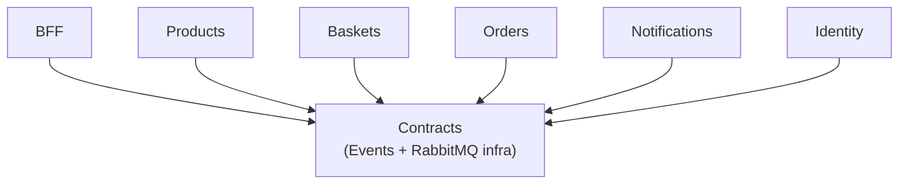

# T01 + Ticket 1 — Scaffold EcommerceDemo Solution, Projects, and Shared Contracts

## Summary

Established the .NET solution structure for the EcommerceDemo microservices project. Verified the installed .NET SDK (10.0.301), selected `net10.0` as the target framework, created 7 projects (Contracts + 6 service projects), and implemented the shared Contracts project with integration event DTOs and RabbitMQ messaging infrastructure using direct `RabbitMQ.Client`. The solution builds with zero errors and zero warnings.

## What was done

- Ran `dotnet --list-sdks` — found .NET 9.0.313 and .NET 10.0.301 installed; selected .NET 10 (net10.0) as the target framework
- Created `EcommerceDemo.slnx` (new XML solution format) at repo root
- Created `Directory.Build.props` with shared `<TargetFramework>net10.0</TargetFramework>`, `<Nullable>enable</Nullable>`, `<ImplicitUsings>enable</ImplicitUsings>`, `<TreatWarningsAsErrors>true</TreatWarningsAsErrors>`
- Created 7 projects and added them to the solution:
  - `EcommerceDemo/Contracts/` — class library (event DTOs + RabbitMQ infrastructure)
  - `EcommerceDemo/BFF/` — Backend for Frontend
  - `EcommerceDemo/Products/` — Catalog service
  - `EcommerceDemo/Baskets/` — Basket service
  - `EcommerceDemo/Orders/` — Orders service
  - `EcommerceDemo/Notifications/` — Notifications service
  - `EcommerceDemo/Identity/` — Fake identity service
- Added project references: all 6 service projects reference `Contracts`
- Added NuGet packages to Contracts: `RabbitMQ.Client 7.2.2`, `Microsoft.Extensions.Logging.Abstractions`, `Microsoft.Extensions.Configuration.Abstractions`, `Microsoft.Extensions.DependencyInjection.Abstractions`, `Microsoft.Extensions.Hosting.Abstractions`
- Implemented Contracts project:
  - Event DTOs: `OrderSubmitted`, `ProductChanged`, `BasketCheckedOut` (+ `OrderItemDto`, `BasketItemDto`)
  - `IRabbitMqConnection` interface + `RabbitMqConnection` (persistent connection with reconnect, semaphore-guarded)
  - `IEventPublisher` interface + `EventPublisher` (publishes JSON to RabbitMQ, injects W3C `traceparent` into message headers for distributed tracing)
  - `EventConsumer<T>` base class (BackgroundService pattern, extracts `traceparent` from headers, creates linked activities, auto-ack/nack)
  - `ServiceCollectionExtensions.AddRabbitMqMessaging()` DI registration helper
  - Shared `ActivitySource` named `"RabbitMQ"` for OpenTelemetry tracing
- Each service has a minimal `Program.cs` that starts an empty web server with startup logging
- Identity service intentionally has no RabbitMQ (minimal per ticket spec)

## Project dependency graph



## Key decisions

- **Target framework: net10.0** — .NET 10.0.301 is the latest stable SDK installed; no .NET 8 SDK present. PLAN.md says to use the latest stable SDK when compatible.
- **Solution format: .slnx** — .NET 10's `dotnet new sln` creates the new XML-based `.slnx` format by default.
- **Project template: `dotnet new web`** — Used the empty web template instead of `webapi` to avoid the `Microsoft.OpenApi` vulnerability warning (NU1903) that fails under `TreatWarningsAsErrors`. Services are minimal for this ticket.
- **RabbitMQ.Client 7.x API changes** — `DispatchConsumersAsync` is no longer needed (async is default in 7.x), and `AsyncConsumerConsumerCancelledAsync` event was removed. Adapted the connection class accordingly.
- **Distributed tracing built in from the start** — `EventPublisher` injects W3C `traceparent` into RabbitMQ message headers; `EventConsumer` extracts it and creates linked activities. This prepares the infrastructure for the OpenTelemetry + Jaeger ticket (T10).

## Artifacts created

- `Directory.Build.props` — shared build settings (TargetFramework, Nullable, ImplicitUsings, TreatWarningsAsErrors)
- `EcommerceDemo.slnx` — solution file
- `EcommerceDemo/Contracts/Contracts.csproj` — Contracts project file with NuGet packages
- `EcommerceDemo/Contracts/Events/IntegrationEvents.cs` — event DTOs (OrderSubmitted, ProductChanged, BasketCheckedOut)
- `EcommerceDemo/Contracts/Messaging/IRabbitMqConnection.cs` — connection interface
- `EcommerceDemo/Contracts/Messaging/RabbitMqConnection.cs` — persistent connection with reconnect
- `EcommerceDemo/Contracts/Messaging/IEventPublisher.cs` — publisher interface
- `EcommerceDemo/Contracts/Messaging/EventPublisher.cs` — publisher with W3C traceparent injection
- `EcommerceDemo/Contracts/Messaging/EventConsumer.cs` — consumer base class with traceparent extraction
- `EcommerceDemo/Contracts/Messaging/ServiceCollectionExtensions.cs` — DI registration helper
- `EcommerceDemo/BFF/Program.cs` — minimal BFF with RabbitMQ DI and startup logging
- `EcommerceDemo/Products/Program.cs` — minimal Products with RabbitMQ DI and startup logging
- `EcommerceDemo/Baskets/Program.cs` — minimal Baskets with RabbitMQ DI and startup logging
- `EcommerceDemo/Orders/Program.cs` — minimal Orders with RabbitMQ DI and startup logging
- `EcommerceDemo/Notifications/Program.cs` — minimal Notifications with RabbitMQ DI and startup logging
- `EcommerceDemo/Identity/Program.cs` — minimal Identity (no RabbitMQ) with startup logging

## Testing & verification

- [x] `dotnet build EcommerceDemo.slnx` — Build succeeded, 0 warnings, 0 errors
- [x] Identity service started and responded with HTTP 200 "Hello from Identity" at `http://localhost:5005/`
- [x] `git status --short` — clean working tree after commit

```
dotnet build EcommerceDemo.slnx --nologo -v q
Build succeeded.
    0 Warning(s)
    0 Error(s)
```

## Dependencies

- **Blocked by:** None — this is the first ticket (frontier)
- **Unblocks:** [[T03-rabbitmq-contracts-design]] (T03 — RabbitMQ contracts design), [[02-products-service]] (Ticket 2 — Products), [[03-baskets-service]] (Ticket 3 — Baskets), [[04-identity-service]] (Ticket 4 — Identity), [[05-orders-service]] (Ticket 5 — Orders), [[06-notifications-service]] (Ticket 6 — Notifications), [[09-distributed-tracing]] (Ticket 9 — Distributed tracing)

## Notes for presentation

- The solution structure is the foundation — every subsequent ticket builds on these 7 projects
- The Contracts project is the shared infrastructure that all services depend on for messaging
- Distributed tracing hooks (W3C traceparent injection/extraction) are already built in, making the OpenTelemetry ticket (T10) straightforward
- The `TreatWarningsAsErrors` setting enforces code quality from the start
- Show the build output (0 errors, 0 warnings) and the live Identity service response

## Next steps

All downstream tickets have been completed. The scaffold laid the foundation for:
- [[T03-rabbitmq-contracts-design]] — RabbitMQ contracts design (resolved)
- [[02-products-service]] — Products service (done)
- [[03-baskets-service]] — Baskets service (done)
- [[04-identity-service]] — Identity service (done)
- [[05-orders-service]] — Orders service (done)
- [[06-notifications-service]] — Notifications service (done)
- [[09-distributed-tracing]] — Distributed tracing (done)
