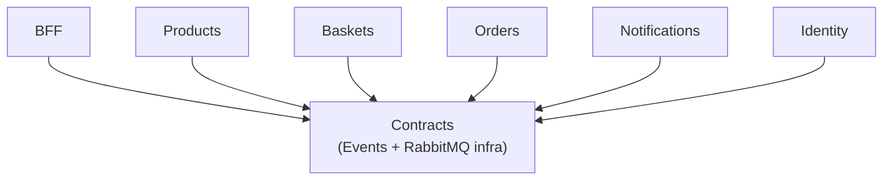
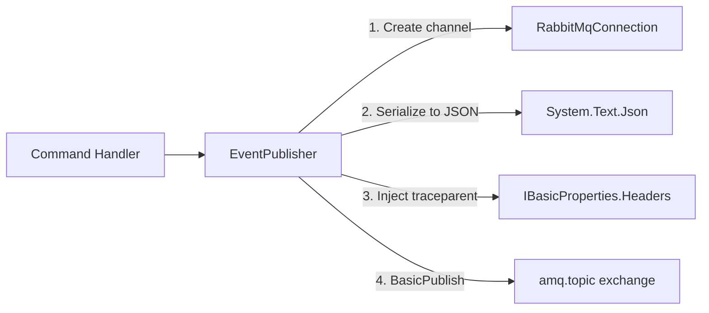

# 🏗️ Solution Scaffolding & Shared Contracts Infrastructure

> [!abstract]
> **Core Idea**
>
> Before building microservices, you need a shared foundation: a solution structure, shared event contracts, and RabbitMQ messaging infrastructure. This note covers the **solution scaffolding pattern** and the **shared contracts library** that all services depend on.

---

## 🎯 Learning Objectives

After reading this note, you should be able to:

- Structure a .NET microservices solution with a shared Contracts project
- Implement integration event DTOs as C# records
- Build a persistent RabbitMQ connection with lazy reconnect
- Create publish/consume abstractions over raw `RabbitMQ.Client`
- Inject W3C `traceparent` headers for distributed tracing from day one

---

## 🧩 Main Concepts

### 1. Solution Structure: The Shared Contracts Pattern

#### Definition

A **shared contracts library** is a class library project that contains integration event DTOs and messaging infrastructure shared across all microservices. Every service references it, ensuring a single source of truth for event definitions.

#### Why It Exists

Without a shared contracts project, each service would define its own version of event DTOs. When an event schema changes, you'd need to update every service independently — a maintenance nightmare.

#### Problem It Solves

Event schema drift. If Products publishes `ProductChanged` with fields `{Id, Name, Price}` but Baskets expects `{ProductId, ProductName, UnitPrice}`, the system breaks silently. A shared library eliminates this.

#### How It Works



All six service projects reference `Contracts`. The Contracts project references `RabbitMQ.Client` and `Microsoft.Extensions.*` abstractions.

> [!tip]
> NuGet packages in Contracts flow transitively to all services. This means you add `RabbitMQ.Client` once — not six times.

---

### 2. Integration Events as C# Records

#### Definition

An **integration event** is a message published when something happens in one service that other services need to know about. Unlike domain events (internal to a bounded context), integration events cross service boundaries.

#### Implementation

```csharp
// Contracts/Events/IntegrationEvents.cs

namespace Contracts.Events;

/// <summary>
/// Published when an order is submitted/created.
/// </summary>
public record OrderSubmitted(
    Guid OrderId,
    string CustomerId,
    decimal Total,
    List<OrderItemDto> Items,
    DateTime CreatedAt);

/// <summary>
/// Published when a product is created, updated, or deleted.
/// </summary>
public record ProductChanged(
    Guid ProductId,
    string Name,
    decimal Price,
    string ChangeType);

/// <summary>
/// Published when a basket is checked out.
/// </summary>
public record BasketCheckedOut(
    string CustomerId,
    List<BasketItemDto> Items,
    DateTime CheckedOutAt);
```

> [!info]
> Using `record` types gives us value equality, immutability, and structural comparison — all critical for event contracts that must be versioned and compared.

---

### 3. Persistent RabbitMQ Connection

#### Definition

A **persistent connection** maintains a long-lived TCP connection to RabbitMQ, reconnecting automatically if the connection drops. This avoids the overhead of connecting per publish/consume.

#### Problem It Solves

Without a persistent connection, every `IEventPublisher.PublishAsync()` call would open a TCP connection, publish, and close it. Under load, this exhausts connections and adds latency.

#### Implementation Progress

**Step 1 — Interface:**

```csharp
public interface IRabbitMqConnection
{
    bool IsConnected { get; }
    IModel CreateModel();
    bool TryConnect();
}
```

**Step 2 — Implementation with semaphore-guarded reconnect:**

```csharp
public class RabbitMqConnection : IRabbitMqConnection, IDisposable
{
    private readonly IConnectionFactory _connectionFactory;
    private IConnection? _connection;
    private readonly SemaphoreSlim _semaphore = new(1, 1);
    private bool _disposed;

    public RabbitMqConnection(IConnectionFactory connectionFactory)
    {
        _connectionFactory = connectionFactory;
    }

    public bool IsConnected => _connection is { IsOpen: true };

    public IModel CreateModel()
    {
        if (!IsConnected) TryConnect();
        return _connection!.CreateModel();
    }

    public bool TryConnect()
    {
        _semaphore.Wait();
        try
        {
            if (IsConnected) return true;
            _connection = _connectionFactory.CreateConnection();
            return true;
        }
        catch
        {
            return false;
        }
        finally
        {
            _semaphore.Release();
        }
    }
}
```

> [!warning]
> RabbitMQ.Client 7.x changed the async API. `DispatchConsumersAsync` is no longer needed (async is default). `AsyncConsumerConsumerCancelledAsync` was removed. Adapt your connection class accordingly.

---

### 4. Event Publisher with W3C Traceparent Injection

#### Definition

The **EventPublisher** serializes an event to JSON, creates a RabbitMQ channel, injects the W3C `traceparent` header for distributed tracing, and publishes to an exchange with a routing key.

#### How It Works



#### Code Diff: Before vs After Traceparent

**Before (no tracing):**

```csharp
public async Task PublishAsync<T>(string exchange, string routingKey, T @event)
{
    using var channel = _connection.CreateModel();
    var body = JsonSerializer.SerializeToUtf8Bytes(@event);
    channel.BasicPublish(exchange, routingKey, body: body);
}
```

**After (with W3C traceparent):**

```csharp
public async Task PublishAsync<T>(string exchange, string routingKey, T @event)
{
    using var channel = _connection.CreateModel();
    var body = JsonSerializer.SerializeToUtf8Bytes(@event);

    var props = channel.CreateBasicProperties();
    props.Persistent = true;

    // Inject W3C traceparent for distributed tracing
    using var activity = _activitySource.StartActivity("RabbitMQ.Publish", ActivityKind.Producer);
    if (Activity.Current is not null)
    {
        var traceparent = $"00-{Activity.Current.TraceId}-{Activity.Current.SpanId}-01";
        props.Headers ??= new Dictionary<string, object?>();
        props.Headers["traceparent"] = Encoding.UTF8.GetBytes(traceparent);
    }

    channel.BasicPublish(exchange, routingKey, props, body);
}
```

> [!tip]
> Building in traceparent injection from day one means the distributed tracing note is just SDK registration — no refactoring needed.

---

### 5. Event Consumer Base Class

#### Definition

`EventConsumer<T>` is an abstract `BackgroundService` that declares a queue, binds it to `amq.topic` with a routing key, and processes messages. Subclasses implement `HandleAsync`.

#### Implementation

```csharp
public abstract class EventConsumer<T> : BackgroundService
{
    protected abstract string QueueName { get; }
    protected abstract string RoutingKey { get; }
    protected abstract Task HandleAsync(T @event, CancellationToken ct);

    protected override Task ExecuteAsync(CancellationToken ct)
    {
        var channel = _connection.CreateModel();
        channel.QueueDeclare(QueueName, durable: true, autoDelete: false);
        channel.QueueBind(QueueName, "amq.topic", RoutingKey);

        var consumer = new AsyncEventingBasicConsumer(channel);
        consumer.ReceivedAsync += async (_, ea) =>
        {
            // Extract traceparent and create linked activity
            var traceparent = ExtractTraceparent(ea.BasicProperties);
            using var activity = _activitySource.StartActivity("RabbitMQ.Consume",
                ActivityKind.Consumer, traceparent);

            var @event = JsonSerializer.Deserialize<T>(ea.Body.Span)!;
            await HandleAsync(@event, ct);
            channel.BasicAck(ea.DeliveryTag, multiple: false);
        };

        channel.BasicConsume(QueueName, autoAck: false, consumer);
        return Task.CompletedTask;
    }
}
```

> [!info]
> The consumer creates a **linked activity** from the extracted traceparent. This means the consume span appears as a child of the publish span in Jaeger — even though they're in different services.

---

## 🛠️ Implementation Process

### Step 1 — Verify SDK and create solution

```bash
dotnet --list-sdks
# Found: 10.0.301 → target net10.0

dotnet new sln -n EcommerceDemo  # Creates .slnx (new XML format)
```

### Step 2 — Create projects

```bash
dotnet new classlib -o EcommerceDemo/Contracts
dotnet new web -o EcommerceDemo/BFF
dotnet new web -o EcommerceDemo/Products
dotnet new web -o EcommerceDemo/Baskets
dotnet new web -o EcommerceDemo/Orders
dotnet new web -o EcommerceDemo/Notifications
dotnet new web -o EcommerceDemo/Identity
```

### Step 3 — Add project references

All six service projects reference Contracts:

```xml
<!-- In each service .csproj -->
<ProjectReference Include="..\Contracts\Contracts.csproj" />
```

### Step 4 — Shared build settings

```xml
<!-- Directory.Build.props -->
<Project>
  <PropertyGroup>
    <TargetFramework>net10.0</TargetFramework>
    <Nullable>enable</Nullable>
    <ImplicitUsings>enable</ImplicitUsings>
    <TreatWarningsAsErrors>true</TreatWarningsAsErrors>
  </PropertyGroup>
</Project>
```

> [!danger]
> `TreatWarningsAsErrors` is enforced from day one. This caught deprecated `WithOpenApi()` in .NET 10 and `NU1903` vulnerability warnings early.

---

## 📊 Key Decisions

| Decision | Choice | Why |
|----------|--------|-----|
| Target framework | `net10.0` | Latest stable SDK (10.0.301) |
| Solution format | `.slnx` | .NET 10 default (XML-based) |
| Project template | `dotnet new web` | Avoids `Microsoft.OpenApi` vulnerability warning (NU1903) |
| RabbitMQ client | `RabbitMQ.Client 7.2.2` | Direct API, no MassTransit — educational visibility |
| Serialization | `System.Text.Json` | Built-in, performant, no extra dependencies |
| Tracing | W3C traceparent in headers | Built in from day one — enables Jaeger later |

---

## ✅ Testing & Verification

- [x] `dotnet build EcommerceDemo.slnx` — 0 warnings, 0 errors
- [x] Identity service started and responded with HTTP 200

```
dotnet build EcommerceDemo.slnx --nologo -v q
Build succeeded.
    0 Warning(s)
    0 Error(s)
```

---

## 📎 See Also

- [[02-rabbitmq-messaging-topology]] — RabbitMQ messaging topology design
- [[03-cqrs-with-mediatr]] — First service using CQRS + MediatR
- [[10-distributed-tracing-with-opentelemetry]] — OpenTelemetry SDK registration (uses the traceparent infrastructure built here)

---

