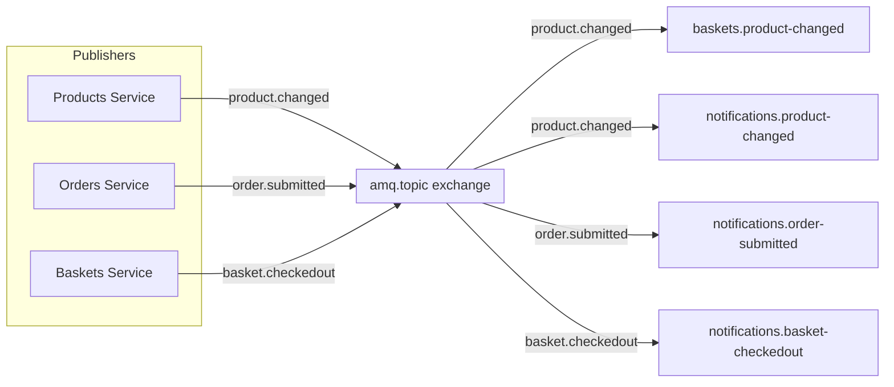

# 📡 RabbitMQ Messaging Topology Design

> [!abstract]
> **Core Idea**
>
> Before building services that publish/consume events, you need a clear messaging topology: which exchange, which routing keys, which queues, and how the publisher/consumer contract works. This note documents the design decisions for the RabbitMQ messaging layer — the `amq.topic` exchange, dot-separated routing keys, durable per-consumer queues, and the W3C traceparent propagation built into the publisher and consumer.

---

## 🎯 Learning Objectives

- Design a **RabbitMQ topology** (exchange, routing keys, queue naming)
- Define the **publisher contract** (`IEventPublisher.PublishAsync`)
- Define the **consumer contract** (`EventConsumer<T>` abstract base class)
- Understand why **direct `RabbitMQ.Client`** was chosen over MassTransit
- See how **W3C traceparent** propagation is built into the messaging layer

---

## 🧩 Main Concepts

### 1. Exchange and Routing Key Topology

#### Definition

RabbitMQ uses an **exchange** to route messages to queues based on **routing keys**. We use the built-in `amq.topic` exchange with dot-separated routing keys.

#### Topology



#### Routing Key Convention

| Event | Routing Key | Publisher | Consumers |
|-------|-------------|-----------|-----------|
| Product created/updated/deleted | `product.changed` | Products | Baskets, Notifications |
| Order submitted | `order.submitted` | Orders | Notifications |
| Basket checked out | `basket.checkedout` | Baskets | (future) |

> [!info]
> Dot-separated routing keys (`product.changed`) are human-readable and support RabbitMQ's topic wildcard matching (`product.*` matches all product events). This is simpler than header-based routing.

---

### 2. Publisher Contract

#### Definition

`IEventPublisher.PublishAsync<T>(exchange, routingKey, event)` — serializes the event to JSON, creates a channel, injects the W3C traceparent header, and publishes to `amq.topic`.

```csharp
public interface IEventPublisher
{
    Task PublishAsync<T>(string exchange, string routingKey, T @event);
}
```

#### Key Design Decisions

- **Channel-per-publish**: Creates a new channel for each publish (no long-lived channel management). Simple, no state to manage.
- **System.Text.Json serialization**: Built-in, no extra dependencies.
- **W3C traceparent in headers**: Injects `traceparent` into `IBasicProperties.Headers` for distributed tracing.
- **Persistent messages**: `props.Persistent = true` — messages survive RabbitMQ restart.

---

### 3. Consumer Contract

#### Definition

`EventConsumer<T>` is an abstract `BackgroundService` that declares a durable queue, binds it to `amq.topic` with a routing key, and processes messages. Subclasses implement `HandleAsync`.

```csharp
public abstract class EventConsumer<T> : BackgroundService
{
    protected abstract string QueueName { get; }
    protected abstract string RoutingKey { get; }
    protected abstract Task HandleAsync(T @event, CancellationToken ct);
}
```

#### Queue Naming Convention

| Consumer | Queue Name | Routing Key |
|----------|-----------|-------------|
| Baskets `ProductChangedConsumer` | `baskets.product-changed` | `product.changed` |
| Notifications `OrderSubmittedConsumer` | `notifications.order-submitted` | `order.submitted` |
| Notifications `ProductChangedConsumer` | `notifications.product-changed` | `product.changed` |

> [!tip]
> Queue names follow `{service}.{event}` convention. Each consumer gets its own queue — so Baskets and Notifications each have their own copy of `ProductChanged` events.

---

### 4. Why Direct RabbitMQ.Client (Not MassTransit)

| Aspect | Direct `RabbitMQ.Client` | MassTransit |
|--------|--------------------------|-------------|
| Educational visibility | ✅ You see channels, exchanges, routing keys | ❌ Hidden behind abstractions |
| Boilerplate | More code | Less code |
| Saga support | Manual (we built our own) | Built-in |
| Retries/DLQ | Manual | Built-in |
| Learning curve | Steeper | Easier |

> [!warning]
> For a **demo/educational project**, direct `RabbitMQ.Client` is better — you see exactly how RabbitMQ works. For **production**, MassTransit or NServiceBus would handle retries, dead-letter queues, and saga orchestration automatically.

---

## 📊 Key Decisions

| Decision | Choice | Why |
|----------|--------|-----|
| Exchange | `amq.topic` (built-in) | No need to declare a custom exchange |
| Routing keys | Dot-separated (`product.changed`) | Human-readable, supports wildcards |
| Queue durability | Durable | Messages survive RabbitMQ restart |
| Serialization | `System.Text.Json` | Built-in, no extra dependencies |
| Traceparent | W3C in message headers | Built in from day one — enables Jaeger tracing |
| Client library | Direct `RabbitMQ.Client 7.2.2` | Educational visibility — no MassTransit abstraction |

---

## ✅ Testing & Verification

- [x] `dotnet build EcommerceDemo.slnx` — 0 warnings, 0 errors
- [x] Clean working tree after commit

---

## 📎 See Also

- [[01-solution-scaffolding-and-contracts]] — Implementation of the publisher, consumer, and connection
- [[03-cqrs-with-mediatr]] — First service to publish events (`ProductChanged`)
- [[04-basket-operations-and-event-consumer]] — First service to consume events (`ProductChangedConsumer`)
- [[07-event-driven-consumer-pattern]] — Consumes both `OrderSubmitted` and `ProductChanged`
- [[10-distributed-tracing-with-opentelemetry]] — OpenTelemetry SDK registration (uses the traceparent infrastructure)

---

