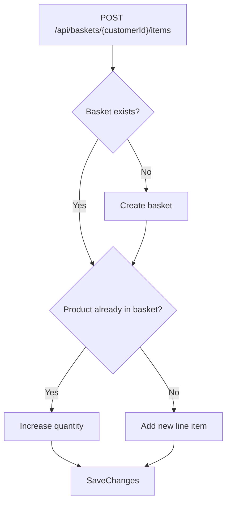
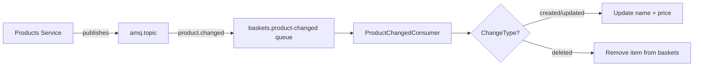

# 🛒 Baskets Service: Basket Ops + Event Consumer + EF Core Gotchas

> [!abstract]
> **Core Idea**
>
> The Baskets service manages shopping baskets with add/remove/checkout operations. It demonstrates **event-driven architecture** by consuming `ProductChanged` events to keep basket item names/prices in sync, and reveals a critical **EF Core InMemory change tracking gotcha** that required a design pivot.

---

## 🎯 Learning Objectives

- Implement basket operations (add, remove, checkout) with MediatR CQRS
- Build a **RabbitMQ event consumer** that reacts to `ProductChanged` events
- Understand the **EF Core InMemory `DbUpdateConcurrencyException`** trap and how to avoid it
- Use scoped `DbContext` in a singleton `BackgroundService` (avoiding captive dependencies)

---

## 🧩 Main Concepts

### 1. Basket Operations with MediatR

#### Definition

Basket operations follow the same CQRS pattern as Products — queries for reads, commands for writes. The key difference is that baskets are **per-customer** and items can be added incrementally.

#### How It Works



#### Implementation

```csharp
public class AddBasketItemHandler : IRequestHandler<AddBasketItemCommand, Basket>
{
    public async Task<Basket> Handle(AddBasketItemCommand cmd, CancellationToken ct)
    {
        // Query BasketItems directly (not Include) to avoid change tracking issues
        var basket = await _db.Baskets
            .FirstOrDefaultAsync(b => b.CustomerId == cmd.CustomerId, ct);

        if (basket is null)
        {
            basket = new Basket { CustomerId = cmd.CustomerId };
            _db.Baskets.Add(basket);
            await _db.SaveChangesAsync(ct);
        }

        var existingItem = await _db.BasketItems
            .FirstOrDefaultAsync(i => i.BasketId == basket.Id && i.ProductId == cmd.ProductId, ct);

        if (existingItem is not null)
            existingItem.Quantity += cmd.Quantity;
        else
            _db.BasketItems.Add(new BasketItem
            {
                BasketId = basket.Id,
                ProductId = cmd.ProductId,
                ProductName = cmd.ProductName,
                UnitPrice = cmd.UnitPrice,
                Quantity = cmd.Quantity
            });

        await _db.SaveChangesAsync(ct);
        return basket;
    }
}
```

---

### 2. The EF Core InMemory Change Tracking Trap

#### Problem

> [!danger]
> Using `Include(b => b.Items)` with `basket.Items.Add()` or `basket.Items.Clear()` across multiple requests causes `DbUpdateConcurrencyException` in EF Core InMemory.

#### What Happened

The original code used navigation properties:

```csharp
// ❌ BROKEN — causes DbUpdateConcurrencyException
var basket = await _db.Baskets.Include(b => b.Items)
    .FirstOrDefaultAsync(b => b.CustomerId == customerId);

basket.Items.Clear();  // Throws after checkout + re-add cycle
```

#### Root Cause

EF Core InMemory's change tracker doesn't handle navigation collection mutations well across multiple requests on the same `DbContext` scope. After clearing items and re-adding, the tracker gets confused about entity state.

#### Fix: Query DbSet Directly

```csharp
// ✅ WORKS — query BasketItems DbSet directly
var basket = await _db.Baskets
    .FirstOrDefaultAsync(b => b.CustomerId == customerId);

var items = await _db.BasketItems
    .Where(i => i.BasketId == basket.Id)
    .ToListAsync();

_db.BasketItems.RemoveRange(items);
await _db.SaveChangesAsync();
```

> [!tip]
> Also switched from a shadow foreign key (`HasForeignKey("BasketId")`) to an **explicit `BasketId` property** on `BasketItem`. This gives EF Core a concrete property to track instead of a shadow state.

---

### 3. Event Consumer: Reacting to ProductChanged

#### Definition

The `ProductChangedConsumer` is a `BackgroundService` that listens for `product.changed` events from RabbitMQ and updates basket items to reflect product changes (name, price) or removes items for deleted products.

#### How It Works



#### Implementation

```csharp
public class ProductChangedConsumer : EventConsumer<ProductChanged>
{
    protected override string QueueName => "baskets.product-changed";
    protected override string RoutingKey => "product.changed";

    protected override async Task HandleAsync(ProductChanged evt, CancellationToken ct)
    {
        using var scope = _serviceProvider.CreateScope();
        var db = scope.ServiceProvider.GetRequiredService<BasketDbContext>();

        var items = await db.BasketItems
            .Where(i => i.ProductId == evt.ProductId)
            .ToListAsync(ct);

        if (evt.ChangeType == "deleted")
        {
            db.BasketItems.RemoveRange(items);
        }
        else
        {
            foreach (var item in items)
            {
                item.ProductName = evt.Name;
                item.UnitPrice = evt.Price;
            }
        }

        await db.SaveChangesAsync(ct);
    }
}
```

> [!warning]
> The consumer is a **singleton** `IHostedService`, but `BasketDbContext` is **scoped**. The consumer must create a DI scope per message (`_serviceProvider.CreateScope()`) to avoid the captive dependency anti-pattern.

---

### 4. Checkout: Clear Basket + Publish Event

#### Implementation

```csharp
public class CheckoutBasketHandler : IRequestHandler<CheckoutBasketCommand, BasketCheckedOut>
{
    public async Task<BasketCheckedOut> Handle(CheckoutBasketCommand cmd, CancellationToken ct)
    {
        var items = await _db.BasketItems
            .Where(i => i.Basket.CustomerId == cmd.CustomerId)
            .ToListAsync(ct);

        var evt = new BasketCheckedOut(cmd.CustomerId, items.Select(i => 
            new BasketItemDto(i.ProductId, i.ProductName, i.UnitPrice, i.Quantity)).ToList(),
            DateTime.UtcNow);

        // Clear the basket
        _db.BasketItems.RemoveRange(items);
        await _db.SaveChangesAsync(ct);

        // Best-effort event publish
        try
        {
            await _publisher.PublishAsync("amq.topic", "basket.checkedout", evt);
        }
        catch (Exception ex)
        {
            _logger.LogWarning(ex, "RabbitMQ unavailable — event not published");
        }

        return evt;
    }
}
```

---

## 🛠️ Implementation Process

### Step 1 — Add NuGet packages
MediatR 14.2.0, EF Core InMemory 10.0.12, Swashbuckle 10.2.3

### Step 2 — Create domain models
`Basket` (Id, CustomerId) + `BasketItem` (Id, BasketId, ProductId, ProductName, UnitPrice, Quantity)

### Step 3 — Create DbContext with explicit FK
```csharp
modelBuilder.Entity<BasketItem>()
    .HasOne<Basket>()
    .WithMany()
    .HasForeignKey(i => i.BasketId);  // Explicit FK property
```

### Step 4 — Create MediatR handlers
- Query: `GetBasketQuery`
- Commands: `AddBasketItemCommand`, `RemoveBasketItemCommand`, `CheckoutBasketCommand`

### Step 5 — Create ProductChangedConsumer
Extends `EventConsumer<ProductChanged>`, creates scoped `DbContext` per message

### Step 6 — Create Minimal API endpoints
```
GET    /api/baskets/{customerId}                  — get basket
POST   /api/baskets/{customerId}/items             — add item
DELETE /api/baskets/{customerId}/items/{productId} — remove item
POST   /api/baskets/{customerId}/checkout          — checkout (clears basket, publishes event)
```

---

## 📊 Key Decisions

| Decision | Choice | Why |
|----------|--------|-----|
| Explicit `BasketId` FK | Property on entity | Avoids EF Core InMemory `DbUpdateConcurrencyException` |
| Query `BasketItems` directly | Instead of `Include` | Navigation collection mutations break InMemory change tracker |
| Scoped DbContext in consumer | `CreateScope()` per message | Avoids captive dependency in singleton BackgroundService |
| Best-effort event publishing | try-catch with warning | Service runs locally without RabbitMQ |

---

## ✅ Testing & Verification

- [x] `dotnet build EcommerceDemo.slnx` — 0 warnings, 0 errors
- [x] Full basket lifecycle: add items, remove item, checkout, verify empty
- [x] Swagger UI accessible at `/swagger`
- [x] `ProductChanged` consumer registered as BackgroundService, starts on startup

---

## 📎 See Also

- [[01-solution-scaffolding-and-contracts]] — `EventConsumer<T>` base class
- [[03-cqrs-with-mediatr]] — Publishes `ProductChanged` events consumed here
- [[08-backend-for-frontend-pattern]] — BFF proxies basket endpoints
- [[09-saga-pattern-with-compensation]] — Saga uses basket checkout + restore endpoints

---

