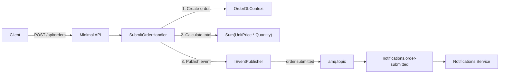

# 📋 Orders Service: CQRS + Server-Side Calculation + OrderSubmitted Event

> [!abstract]
> **Core Idea**
>
> The Orders service accepts order submissions with line items, calculates the total **server-side** (never trusting client-sent totals), persists to EF Core InMemory, and publishes an `OrderSubmitted` integration event. It follows the same CQRS-with-MediatR pattern as Products and Baskets.

---

## 🎯 Learning Objectives

- Implement order submission with **server-side total calculation** (data integrity)
- Publish `OrderSubmitted` events with full order payload
- Apply the **explicit FK pattern** on `OrderItem` (learned from Baskets service)
- Understand why Orders has **no seed data** (unlike Products)

---

## 🧩 Main Concepts

### 1. Server-Side Total Calculation

#### Definition

The order total is computed from line items on the server (`Items.Sum(i => i.UnitPrice * i.Quantity)`), not trusted from the client request.

#### Problem It Solves

> [!danger]
> If the client sends `Total: 0.01` with items worth $1,000, trusting the client total means a $999.99 loss. Server-side calculation prevents price manipulation.

#### Code Diff

**Before (naive — trusts client):**

```csharp
// ❌ DANGEROUS — client controls the total
var order = new Order
{
    CustomerId = cmd.CustomerId,
    Items = cmd.Items,
    Total = cmd.Total  // Client-sent total!
};
```

**After (secure — server calculates):**

```csharp
// ✅ SECURE — server computes total from line items
var order = new Order
{
    CustomerId = cmd.CustomerId,
    Items = cmd.Items.Select(i => new OrderItem
    {
        ProductId = i.ProductId,
        ProductName = i.ProductName,
        UnitPrice = i.UnitPrice,
        Quantity = i.Quantity
    }).ToList()
};
order.Total = order.Items.Sum(i => i.UnitPrice * i.Quantity);
```

---

### 2. OrderSubmitted Event

#### Definition

When an order is created, an `OrderSubmitted` event is published to RabbitMQ. This event carries the full order payload — ID, customer, total, items, timestamp.

#### How It Works



#### Implementation

```csharp
public class SubmitOrderHandler : IRequestHandler<SubmitOrderCommand, Order>
{
    public async Task<Order> Handle(SubmitOrderCommand cmd, CancellationToken ct)
    {
        var order = new Order
        {
            CustomerId = cmd.CustomerId,
            Status = "Submitted",
            CreatedAt = DateTime.UtcNow,
            Items = cmd.Items.Select(i => new OrderItem
            {
                ProductId = i.ProductId,
                ProductName = i.ProductName,
                UnitPrice = i.UnitPrice,
                Quantity = i.Quantity
            }).ToList()
        };
        order.Total = order.Items.Sum(i => i.UnitPrice * i.Quantity);

        _db.Orders.Add(order);
        await _db.SaveChangesAsync(ct);

        // Best-effort event publish
        try
        {
            await _publisher.PublishAsync("amq.topic", "order.submitted",
                new OrderSubmitted(order.Id, order.CustomerId, order.Total,
                    order.Items.Select(i => new OrderItemDto(
                        i.ProductId, i.ProductName, i.UnitPrice, i.Quantity)).ToList(),
                    order.CreatedAt));
        }
        catch (Exception ex)
        {
            _logger.LogWarning(ex, "RabbitMQ unavailable — event not published");
        }

        return order;
    }
}
```

---

### 3. Explicit FK on OrderItem

> [!info]
> Following the same pattern discovered in the Baskets service — explicit `OrderId` FK property on `OrderItem` to avoid EF Core InMemory change tracking issues.

```csharp
modelBuilder.Entity<Order>()
    .HasMany(o => o.Items)
    .WithOne()
    .HasForeignKey(i => i.OrderId);  // Explicit FK, not shadow
```

---

## 🛠️ Implementation Process

### Step 1 — Add NuGet packages
MediatR 14.2.0, EF Core InMemory 10.0.12, Swashbuckle 10.2.3

### Step 2 — Create domain models
`Order` (Id, CustomerId, Items, Total, Status, CreatedAt) + `OrderItem` (Id, OrderId, ProductId, ProductName, UnitPrice, Quantity)

### Step 3 — Create DbContext
`OrderDbContext` with `UseInMemoryDatabase("OrdersDb")`

### Step 4 — Create MediatR handlers
- Queries: `GetOrderByIdQuery`, `GetOrdersByCustomerQuery`
- Command: `SubmitOrderCommand` (creates order, calculates total, publishes event)

### Step 5 — Create Minimal API endpoints
```
POST /api/orders                      — submit order (publishes OrderSubmitted)
GET  /api/orders/{id}                 — get by ID
GET  /api/orders?customerId={id}      — list by customer
```

> [!tip]
> No seed data — unlike Products (which seeds 5 products), Orders starts empty. Orders are user-generated, not pre-seeded.

---

## 📊 Key Decisions

| Decision | Choice | Why |
|----------|--------|-----|
| Total calculation | Server-side | Never trust client-sent totals |
| Explicit FK on OrderItem | Property on entity | Avoids EF Core InMemory change tracking issues |
| Seed data | None | Orders are user-generated |
| Event payload | Full order (items + total) | Consumers get complete context without re-querying |

---

## ✅ Testing & Verification

- [x] `dotnet build EcommerceDemo.slnx` — 0 warnings, 0 errors
- [x] `POST /api/orders` creates order with 2 items, total = 149.97, status = "Submitted"
- [x] `GET /api/orders/{id}` returns order with line items
- [x] `GET /api/orders?customerId=cust-001` returns list of orders
- [x] Swagger UI accessible at `/swagger`

---

## 📎 See Also

- [[01-solution-scaffolding-and-contracts]] — Contracts with `OrderSubmitted` event DTO
- [[04-basket-operations-and-event-consumer]] — Explicit FK pattern discovered here
- [[07-event-driven-consumer-pattern]] — Consumes `OrderSubmitted` events
- [[08-backend-for-frontend-pattern]] — BFF proxies order endpoints
- [[09-saga-pattern-with-compensation]] — Saga uses order submit + cancel

---

