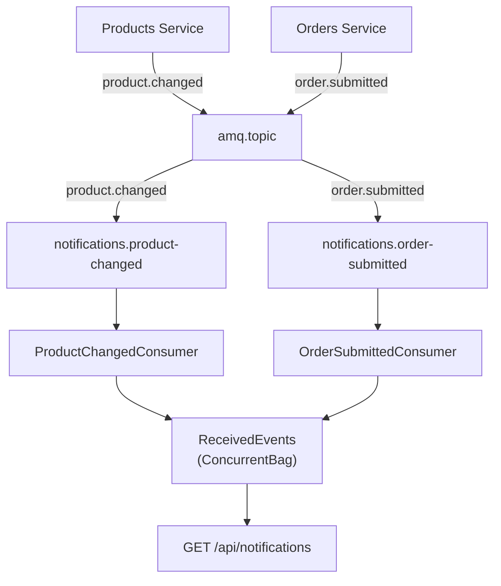

# 🔔 Notifications Service: Event-Driven Consumer Pattern

> [!abstract]
> **Core Idea**
>
> The Notifications service is the **event sink** — it consumes `OrderSubmitted` and `ProductChanged` events from RabbitMQ, stores them in a thread-safe in-memory list, and exposes them via `GET /api/notifications`. It demonstrates the **pub-sub pattern** without a database, without MediatR, and without coupling to any other service.

---

## 🎯 Learning Objectives

- Build **RabbitMQ event consumers** using the `EventConsumer<T>` base class
- Use a **thread-safe in-memory store** (`ConcurrentBag<T>`) shared between BackgroundServices and API
- Understand why Notifications has **no database, no MediatR** — intentionally simple
- See how **separate queues per event type** give each consumer its own copy of events

---

## 🧩 Main Concepts

### 1. The Event Sink Pattern

#### Definition

An **event sink** is a service that subscribes to events and stores/processes them. The Notifications service is the simplest form — it just records every event with a timestamp and makes them queryable.

#### Why It Exists

In an event-driven architecture, services publish events without knowing who consumes them. The Notifications service is the **observable consumer** — it proves events are flowing through the system and provides a single endpoint to inspect all events.

#### How It Works



> [!info]
> Each consumer declares its **own queue** bound to `amq.topic`. This means Notifications gets its own copy of `ProductChanged` — independent of Baskets' `ProductChanged` consumer. This is the pub-sub advantage: multiple independent consumers.

---

### 2. Thread-Safe In-Memory Store

#### Definition

`ReceivedEvents` is a singleton `ConcurrentBag<ReceivedEvent>` shared between the consumer BackgroundServices (writers) and the API endpoint (reader).

#### Implementation

```csharp
public record ReceivedEvent(string EventType, string RoutingKey, string Payload, DateTime ReceivedAt);

public class ReceivedEvents
{
    private readonly ConcurrentBag<ReceivedEvent> _events = new();

    public void Add(ReceivedEvent evt) => _events.Add(evt);
    public IEnumerable<ReceivedEvent> GetAll() => _events.OrderByDescending(e => e.ReceivedAt);
}
```

> [!tip]
> `ConcurrentBag<T>` is thread-safe by design. Multiple BackgroundServices can write concurrently while the API reads — no locks needed.

---

### 3. Event Consumers

#### Implementation

```csharp
public class OrderSubmittedConsumer : EventConsumer<OrderSubmitted>
{
    protected override string QueueName => "notifications.order-submitted";
    protected override string RoutingKey => "order.submitted";

    protected override Task HandleAsync(OrderSubmitted evt, CancellationToken ct)
    {
        _logger.LogInformation("Received OrderSubmitted: OrderId={OrderId}, Total={Total}",
            evt.OrderId, evt.Total);

        _events.Add(new ReceivedEvent(
            EventType: "OrderSubmitted",
            RoutingKey: "order.submitted",
            Payload: JsonSerializer.Serialize(evt),
            ReceivedAt: DateTime.UtcNow));

        return Task.CompletedTask;
    }
}
```

> [!info]
> No MediatR here. The consumers directly write to `ReceivedEvents`, and the endpoint directly reads from it. This keeps the service intentionally simple — no command/query separation needed for a single-endpoint service.

---

## 🛠️ Implementation Process

### Step 1 — Add Swashbuckle.AspNetCore
Only package needed (Contracts provides RabbitMQ infrastructure transitively)

### Step 2 — Create ReceivedEvents store
`ConcurrentBag<ReceivedEvent>` singleton, registered in DI

### Step 3 — Create two consumers
- `OrderSubmittedConsumer` — queue `notifications.order-submitted`, routing key `order.submitted`
- `ProductChangedConsumer` — queue `notifications.product-changed`, routing key `product.changed`

### Step 4 — Register consumers as BackgroundServices
```csharp
builder.Services.AddHostedService<OrderSubmittedConsumer>();
builder.Services.AddHostedService<ProductChangedConsumer>();
```

### Step 5 — Create endpoint
```
GET /api/notifications — returns all received events, most recent first
```

---

## 📊 Key Decisions

| Decision | Choice | Why |
|----------|--------|-----|
| Database | None (in-memory `ConcurrentBag`) | Events are ephemeral — no persistence needed |
| MediatR | None | Single endpoint, no command/query separation needed |
| Queue strategy | Separate queue per event type | Each consumer gets its own copy of events |
| Store lifetime | Singleton | Shared between BackgroundServices (writers) and API (reader) |

---

## ✅ Testing & Verification

- [x] `dotnet build EcommerceDemo.slnx` — 0 warnings, 0 errors
- [x] `GET /api/notifications` returns `[]` (empty — no RabbitMQ running locally)
- [x] Both consumers registered as BackgroundServices, start on startup, retry RabbitMQ connection every 5s
- [x] Full event flow verified via Docker Compose in [[11-docker-compose-and-containerization]]

---

## 📎 See Also

- [[01-solution-scaffolding-and-contracts]] — `EventConsumer<T>` base class
- [[03-cqrs-with-mediatr]] — Publishes `ProductChanged` consumed here
- [[06-order-submission-and-events]] — Publishes `OrderSubmitted` consumed here
- [[11-docker-compose-and-containerization]] — Full event flow verified with Docker Compose

---

