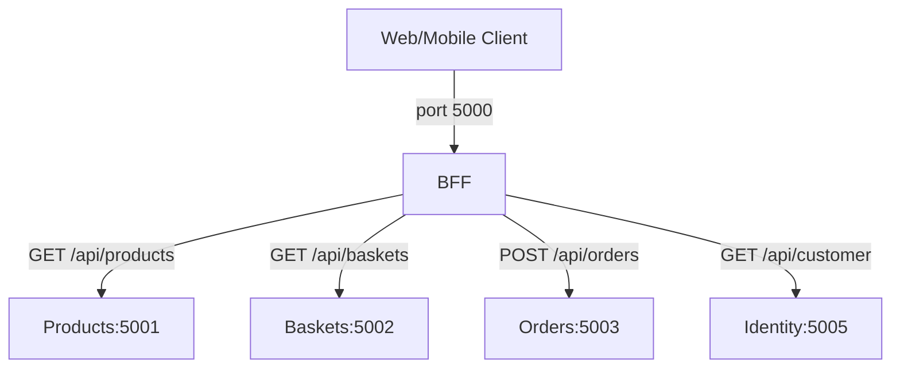
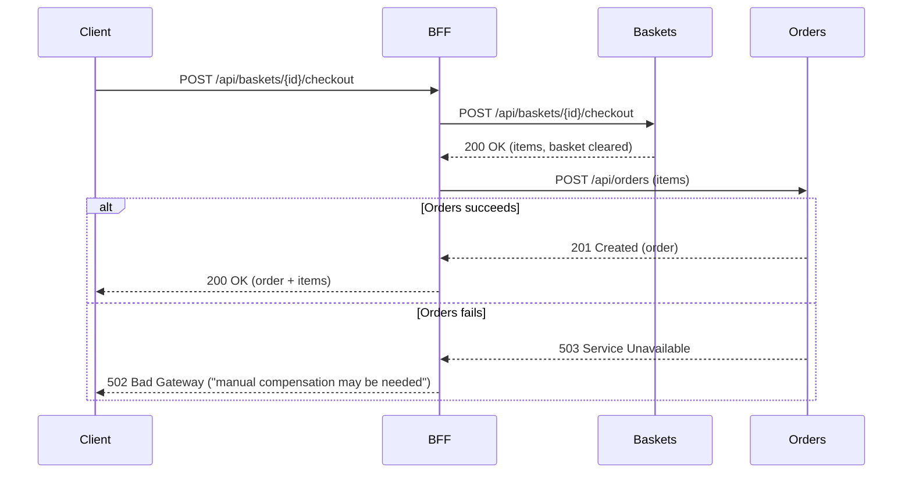

# 🌐 BFF Service: Backend for Frontend Pattern

> [!abstract]
> **Core Idea**
>
> The BFF (Backend for Frontend) is the **single entry point** for all client requests. It routes to downstream services using **Refit typed HTTP clients**, orchestrates checkout (basket → order), and handles errors gracefully (503 for unreachable services, 502 for partial failures). This note covers the BFF pattern, Refit integration, and the synchronous checkout that motivates the saga pattern.

---

## 🎯 Learning Objectives

- Apply the **Backend for Frontend pattern** — a gateway that shields clients from service topology
- Use **Refit** to auto-generate typed HTTP clients from interfaces
- Build a **routing map** that proxies all downstream endpoints through one port
- Implement **error handling** for downstream failures (503/502 with clean JSON)
- Understand why **synchronous checkout** is fragile (motivates the saga pattern)

---

## 🧩 Main Concepts

### 1. The BFF Pattern

#### Definition

A **Backend for Frontend** is a gateway service tailored for a specific UI. Instead of clients calling multiple services directly, they call the BFF, which routes, aggregates, and orchestrates.

#### Why It Exists

Without a BFF, a web client would need to know the URLs of Products, Baskets, Orders, and Identity services. If a service moves or changes port, every client breaks. The BFF centralizes routing.

#### Problem It Solves

Client-to-service coupling. The BFF is the only service the client knows about. Downstream services can be added, removed, or reconfigured without client changes.



---

### 2. Refit Typed HTTP Clients

#### Definition

**Refit** auto-generates HTTP client implementations from C# interfaces. You define an interface with `[Get]`, `[Post]` attributes, and Refit generates the implementation at runtime.

#### Code Diff: Manual HttpClient vs Refit

**Before (manual HttpClient):**

```csharp
// ❌ Verbose — manual serialization, URL construction, error handling
using var response = await _httpClient.GetAsync($"$"{_baseUrl}/api/products");
var json = await response.Content.ReadAsStringAsync();
var products = JsonSerializer.Deserialize<List<Product>>(json);
```

**After (Refit interface):**

```csharp
// ✅ Clean — Refit generates the implementation
public interface IProductsClient
{
    [Get("/api/products")]
    Task<List<ProductDto>> GetProductsAsync();

    [Get("/api/products/{id}")]
    Task<ProductDto> GetProductAsync(Guid id);

    [Post("/api/products")]
    Task<ProductDto> CreateProductAsync([Body] CreateProductDto product);
}
```

#### Registration in DI:

```csharp
builder.Services
    .AddRefitClient<IProductsClient>()
    .ConfigureHttpClient(c => c.BaseAddress = new Uri(productsUrl));

builder.Services
    .AddRefitClient<IBasketsClient>()
    .ConfigureHttpClient(c => c.BaseAddress = new Uri(basketsUrl));
```

> [!tip]
> Base addresses come from `appsettings.json` (`Downstream:ProductsUrl`, etc.). In Docker Compose, these are overridden by environment variables pointing to container names (`http://products:5001`).

---

### 3. Checkout Orchestration (Synchronous)

#### Definition

The BFF orchestrates checkout by calling Baskets (clear basket, get items) then Orders (create order from items). This is **synchronous** — if Orders fails after Baskets succeeds, the basket is already cleared.

#### How It Works



> [!danger]
> If Baskets succeeds but Orders fails, the basket is **already cleared** but no order exists. This is the **data inconsistency** that motivates the saga pattern in [[09-saga-pattern-with-compensation]].

---

### 4. Error Handling

#### Implementation

```csharp
static IResult HandleDownstreamError(Exception ex)
{
    return ex switch
    {
        Refit.ApiException apiEx => Results.Json(new
        {
            error = "Downstream service error",
            statusCode = (int)apiEx.StatusCode,
            detail = apiEx.Content
        }, statusCode: (int)apiEx.StatusCode),

        HttpRequestException => Results.Json(new
        {
            error = "Service Unavailable",
            detail = "Downstream service is not reachable"
        }, statusCode: 503),

        _ => Results.Problem("Unexpected error", statusCode: 500)
    };
}
```

> [!info]
> `Refit.ApiException` propagates the downstream status code (404, 400, etc.). `HttpRequestException` means the service is unreachable → 503. This prevents unhandled exceptions when downstream services are down.

---

## 🛠️ Implementation Process

### Step 1 — Add NuGet packages
Refit 8.0.0, Refit.HttpClientFactory 8.0.0, Swashbuckle.AspNetCore 10.2.3

### Step 2 — Create Refit client interfaces
`IProductsClient`, `IBasketsClient`, `IOrdersClient`, `IIdentityClient` + all DTOs

### Step 3 — Register Refit clients in DI
Configure base addresses from `appsettings.json` `Downstream` section

### Step 4 — Create routing map
Proxy all downstream endpoints through BFF on port 5000:
```
GET    /api/identity/customer
GET    /api/products, GET /api/products/{id}, POST, PUT, DELETE
GET    /api/baskets/{id}, POST /api/baskets/{id}/items, DELETE, POST checkout
POST   /api/orders, GET /api/orders/{id}, GET /api/orders?customerId=
```

### Step 5 — Add error handling
`HandleDownstreamError` helper on all proxy endpoints

### Step 6 — Add Swagger UI
All endpoints from all services visible in one Swagger page

---

## 📊 Key Decisions

| Decision | Choice | Why |
|----------|--------|-----|
| HTTP client | Refit 8.0.0 | Auto-generates from interfaces, reduces boilerplate |
| BFF port | 5000 | Standard API gateway port, easy to remember |
| Checkout | Synchronous (for now) | Baseline for saga comparison — saga replaces this in  |
| Error handling | `HandleDownstreamError` helper | Prevents unhandled exceptions, clean JSON responses |
| RabbitMQ | None in BFF | BFF orchestrates via HTTP, not events |

---

## ✅ Testing & Verification

- [x] `dotnet build EcommerceDemo.slnx` — 0 warnings, 0 errors
- [x] BFF starts on port 5000, Swagger UI accessible
- [x] Error handling: downstream unreachable → clean 503 JSON
- [x] Full end-to-end test verified via Docker Compose in [[11-docker-compose-and-containerization]]

---

## 📎 See Also

- [[03-cqrs-with-mediatr]] — Products endpoints proxied by BFF
- [[04-basket-operations-and-event-consumer]] — Baskets endpoints proxied by BFF
- [[06-order-submission-and-events]] — Orders endpoints proxied by BFF
- [[09-saga-pattern-with-compensation]] — Saga replaces the synchronous checkout
- [[11-docker-compose-and-containerization]] — BFF containerized with Docker

---

