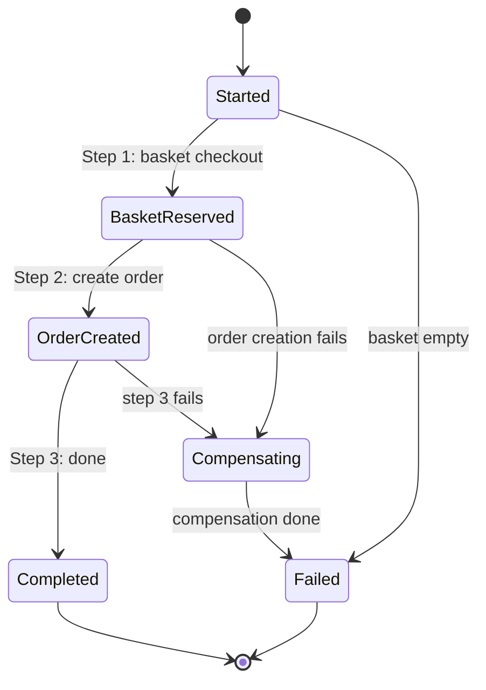

# Ticket 8 — Saga Pattern: Orchestration-Based Checkout with Compensating Transactions

## Summary

Replaced the BFF's simple synchronous checkout with an orchestration-based saga that tracks state, executes steps in order, and runs compensating transactions on failure. The saga persists state in a dedicated `SagaDbContext` (EF Core InMemory), captures a basket snapshot at checkout for compensation, and logs every state transition for educational visibility. On failure (e.g., Orders service down), the saga restores basket items and cancels the order — all visible via `GET /api/sagas/{id}` and `docker compose logs`.

## What was done

- **Baskets service — compensating action:**
  - Added `RestoreBasketCommand` + `RestoreBasketHandler` that re-adds items to a customer's basket from a snapshot
  - Added `POST /api/baskets/{customerId}/restore` endpoint
- **Orders service — compensating action:**
  - Added `CancelOrderCommand` + `CancelOrderHandler` that sets order status to "Cancelled"
  - Added `DELETE /api/orders/{id}/cancel` endpoint
- **BFF service — saga orchestrator:**
  - Added `SagaStatus` enum: `Started`, `BasketReserved`, `OrderCreated`, `Completed`, `Compensating`, `Failed`
  - Added `SagaState` model with JSON-serialized basket snapshot, order ID, error message, timestamps
  - Added `SagaDbContext` (EF Core InMemory, "SagaDb")
  - Added `CheckoutSagaOrchestrator` with 3-step saga:
    - Step 1: Checkout basket (captures snapshot for compensation)
    - Step 2: Create order (stores order ID)
    - Step 3: Mark saga Completed
    - On failure: runs compensating actions in reverse (cancel order if created, restore basket items)
  - Replaced old synchronous checkout endpoint with saga-based `POST /api/baskets/{customerId}/checkout`
  - Added `GET /api/sagas/{id}` endpoint for saga state inspection
  - Updated Refit clients with `RestoreBasketAsync` and `CancelOrderAsync` methods
  - Added `Microsoft.EntityFrameworkCore.InMemory` package to BFF project

## Saga state machine



## Key decisions

- **Enum renamed to `SagaStatus`:** The original plan called for a `SagaState` enum, but we also needed a `SagaState` entity class. To avoid the naming conflict, the enum was renamed to `SagaStatus` while the entity remains `SagaState`.
- **Basket snapshot as JSON:** The basket items captured at checkout are serialized to JSON in the `SagaState.BasketSnapshotJson` field. This keeps the saga state self-contained and queryable without joins.
- **Compensation is best-effort:** If a compensating action itself fails (e.g., Baskets service also down), the saga logs the error and still marks itself as Failed. This is intentional for the demo — production systems would need retry/dead-letter queues.
- **Saga state stored in BFF:** The `SagaDbContext` lives in the BFF service, not in a separate saga service. This keeps the demo architecture simple while still demonstrating the orchestration pattern.

## Artifacts created

- `EcommerceDemo/Baskets/Features/Commands/RestoreBasket.cs` — RestoreBasketCommand + handler (compensating action)
- `EcommerceDemo/Orders/Features/Commands/CancelOrder.cs` — CancelOrderCommand + handler (compensating action)
- `EcommerceDemo/BFF/Saga/SagaState.cs` — SagaStatus enum, SagaState entity, BasketItemSnapshot record
- `EcommerceDemo/BFF/Saga/SagaDbContext.cs` — EF Core InMemory DbContext for saga state
- `EcommerceDemo/BFF/Saga/CheckoutSagaOrchestrator.cs` — 3-step saga orchestrator with compensation

## Artifacts modified

- `EcommerceDemo/Baskets/Program.cs` — Added `POST /api/baskets/{customerId}/restore` endpoint
- `EcommerceDemo/Orders/Program.cs` — Added `DELETE /api/orders/{id}/cancel` endpoint
- `EcommerceDemo/BFF/Program.cs` — Registered SagaDbContext + orchestrator, replaced checkout endpoint, added saga inspection endpoint
- `EcommerceDemo/BFF/Clients/IDownstreamClients.cs` — Added RestoreBasketAsync, CancelOrderAsync, RestoreBasketItemRequest DTO
- `EcommerceDemo/BFF/BFF.csproj` — Added Microsoft.EntityFrameworkCore.InMemory package

## Testing & verification

- [x] `dotnet build EcommerceDemo.slnx` succeeds with zero errors and zero warnings

```
dotnet build EcommerceDemo.slnx
Build succeeded in 2.3s
```

- [x] Full stack verification (Docker Compose with saga failure simulation) — verified in [[10-docker-compose]]

## Dependencies

- **Blocked by:** [[07-bff-service]] (BFF: Refit clients + routing map + checkout orchestration)
- **Unblocks:** [[10-docker-compose]] (Docker Compose — needs saga endpoints), [[11-http-examples-and-readme]] (HTTP examples + README — needs saga documentation)

> The saga depends on the BFF's Refit clients ([[07-bff-service]]), the Baskets restore endpoint ([[03-baskets-service]]), and the Orders cancel endpoint ([[05-orders-service]]).

## Notes for presentation

- Walk through the saga state machine: Started → BasketReserved → OrderCreated → Completed
- Show the compensation flow: stop the Orders container, trigger checkout, show basket restored
- Use `GET /api/sagas/{id}` to show persisted saga state with basket snapshot
- Saga state transitions are logged — show `docker compose logs bff | findstr "saga"` for visibility
- Key talking point: the saga pattern makes failure handling explicit and observable, unlike the old synchronous checkout which left the basket cleared on order creation failure

## Next steps

All downstream tickets have been completed:
- [[09-distributed-tracing]] — Distributed tracing (done)
- [[10-docker-compose]] — Docker Compose (done)
- [[11-http-examples-and-readme]] — HTTP examples + README (done)
