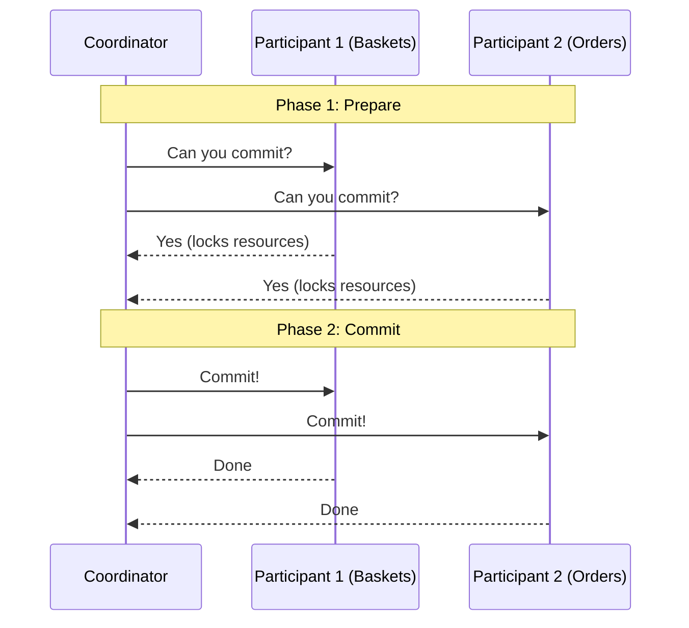
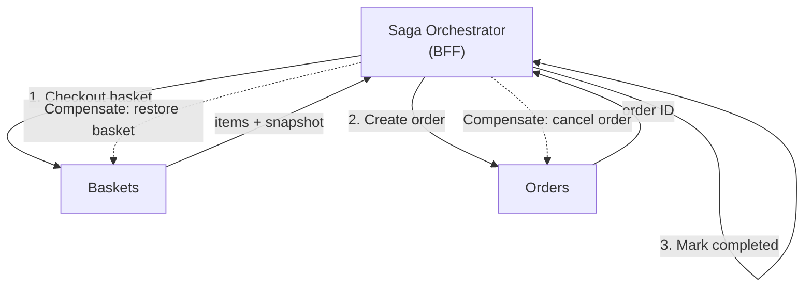
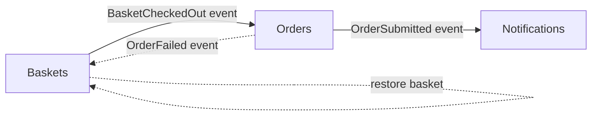
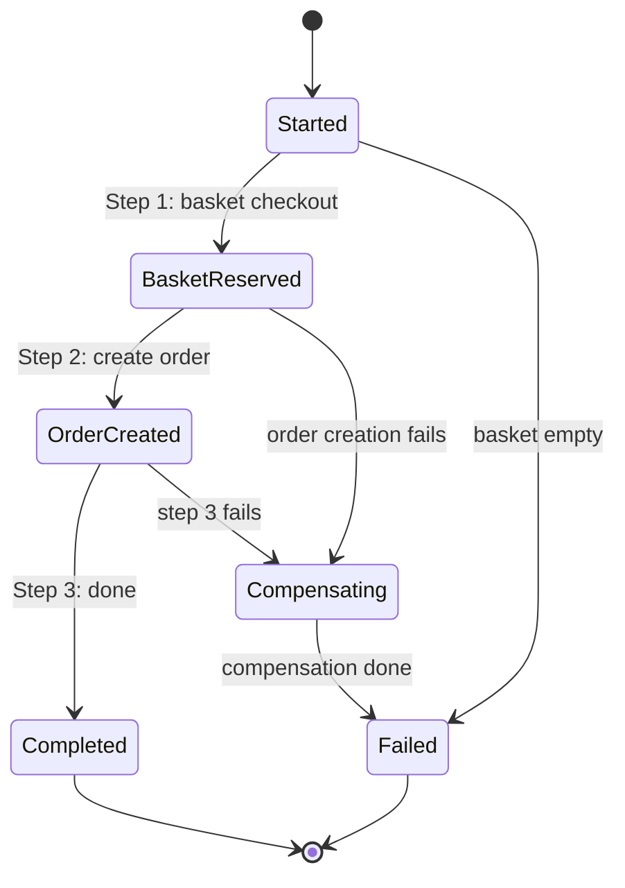
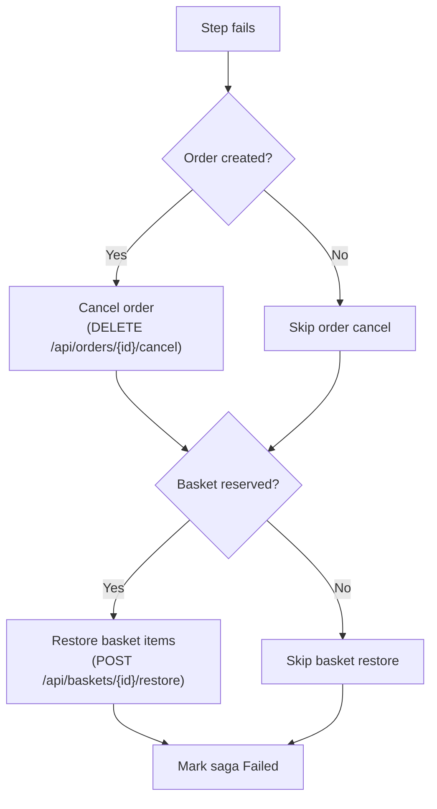

# 🔄 Saga Pattern: Orchestration-Based Checkout with Compensating Transactions

> [!abstract]
> **Core Idea**
>
> In a microservices system, a single business operation (like checkout) spans multiple services and databases. You can't use a database transaction across service boundaries. This note covers the **distributed transaction problem**, the traditional **Two-Phase Commit (2PC)** protocol and its drawbacks, the **saga pattern** as the modern alternative, the two saga implementation types (orchestration vs choreography), and a concrete code implementation of an orchestrated saga with compensating transactions.

---

## 🎯 Learning Objectives

- Understand the **distributed transaction problem** — why operations across services can't use traditional ACID transactions
- Explain **Two-Phase Commit (2PC)** and why it's rarely used in microservices (blocking, latency, single point of failure)
- Understand the **saga pattern** — a sequence of local transactions with compensating actions
- Compare **orchestrated vs choreographed sagas** and when to use each
- Implement a **state machine** for checkout (Started → BasketReserved → OrderCreated → Completed)
- Design **compensating transactions** (cancel order, restore basket items)
- Persist saga state in a dedicated `SagaDbContext` for observability
- Capture a **basket snapshot** at checkout for compensation
- Compare **2PC vs Sagas** — atomicity vs eventual consistency

---

## 🧩 Main Concepts

### 1. Distributed Transactions: The Fundamental Challenge

#### Definition

A **distributed transaction** is an operation that must update data across multiple independent systems (services, databases). The challenge is ensuring that either **all updates succeed** or **all fail** — maintaining system consistency.

#### Why It Exists

In a monolith, a single database transaction can span multiple tables. If any insert fails, the entire transaction rolls back. In microservices, each service has its own database. There's no single transaction coordinator that can roll back across PostgreSQL, MongoDB, and an in-memory store simultaneously.

#### Problem It Solves

The "partial failure" problem. If checkout clears the basket (Baskets DB) but fails to create the order (Orders DB), the system is in an inconsistent state — the customer lost their basket items but has no order. The question is: **how do we either complete both operations or undo both?**

> [!info]
> This is the **CAP theorem** in practice: in a distributed system, you can't have strong consistency across services without sacrificing availability. Sagas choose **eventual consistency** — the system may be temporarily inconsistent but converges to a consistent state.

---

### 2. Two-Phase Commit (2PC): The Traditional Approach

#### Definition

**Two-Phase Commit (2PC)** is a synchronous protocol that uses a **central coordinator** to manage transactions across multiple participants (resource managers). It works in two phases:

1. **Prepare phase**: The coordinator asks all participants "can you commit?" Each participant locks its resources and responds Yes/No.
2. **Commit phase**: If all participants said Yes, the coordinator sends "commit." If any said No, the coordinator sends "rollback."



#### Drawbacks

> [!danger]
> 2PC is rarely used in microservices because of three critical problems:

| Drawback | Explanation |
|----------|-------------|
| **Blocking** | Participants lock resources during the prepare phase. If the coordinator crashes, participants hold locks indefinitely — blocking the entire system. |
| **Latency** | The coordinator must wait for the slowest participant. One slow service slows down the entire transaction. |
| **Single point of failure** | If the coordinator crashes between Phase 1 and Phase 2, participants are stuck in an uncertain state — they don't know whether to commit or rollback. |
| **Tight coupling** | All participants must support 2PC. In heterogeneous systems (SQL + NoSQL + message brokers), this is impractical. |

> [!warning]
> 2PC provides **strong atomicity** (all-or-nothing), but at the cost of availability and performance. In microservices, where services must be independently deployable and scalable, 2PC's blocking behavior is unacceptable.

---

### 3. Sagas: The Microservices Alternative

#### Definition

A **saga** is a sequence of **local transactions** where each step has a **compensating transaction** that undoes its effects. If any step fails, the saga runs compensating actions in reverse order to restore the system to a consistent state.

#### Why It Exists

In a distributed system, you can't use a database transaction across services. If Baskets clears the basket and Orders fails to create the order, there's no automatic rollback. The saga pattern provides **application-level compensation** instead.

#### Problem It Solves

Data inconsistency from partial failures. Without a saga, the BFF's synchronous checkout leaves the basket cleared but no order created when Orders is down.

#### Key Difference from 2PC

| Aspect | 2PC | Saga |
|--------|-----|------|
| Consistency | Strong (atomic) | Eventual |
| Blocking | Yes (locks during prepare) | No (no locks) |
| Failure handling | Automatic rollback | Compensating transactions |
| Coordinator | Required (central) | Optional (orchestrated) or none (choreographed) |
| Performance | Slow (synchronous, blocking) | Fast (async, non-blocking) |
| Use case | Single-system, homogeneous | Microservices, heterogeneous |

> [!tip]
> Sagas trade **strong consistency** for **availability and performance**. The system may be temporarily inconsistent (e.g., basket cleared but order not yet created), but it converges to a consistent state through compensation.

---

### 4. Saga Implementation Types

#### Orchestrated Saga

A **central coordinator** (the orchestrator) explicitly manages the saga flow. It tells each service what to do and tracks the state.



**Characteristics:**
- ✅ Easier to track and audit — all state in one place
- ✅ Clear flow — the orchestrator knows the full saga
- ✅ Easier to debug — query the saga state table
- ❌ Central coordinator is a potential bottleneck
- ❌ Orchestrator must know about all participating services

> [!info]
> **This project uses orchestrated saga.** The BFF service contains `CheckoutSagaOrchestrator` which manages the 3-step checkout flow and tracks state in `SagaDbContext`.

#### Choreographed Saga

Services communicate via **events** autonomously. No central coordinator — each service reacts to events and publishes its own.



**Characteristics:**
- ✅ More scalable — no central coordinator
- ✅ Loosely coupled — services don't know about each other
- ✅ Easy to add new participants (just subscribe to events)
- ❌ Harder to trace — no single place to see saga state
- ❌ More complex to debug — must follow event chain
- ❌ Risk of cyclic dependencies

> [!tip]
> **Choreography** works well for simple flows with few services. **Orchestration** is better when the flow is complex, has many steps, or requires centralized tracking. This project chose orchestration because the checkout flow is complex and we wanted a single `GET /api/sagas/{id}` endpoint for debugging.

#### Comparison

| Aspect | Orchestrated | Choreographed |
|--------|-------------|---------------|
| Coordinator | Central orchestrator | None (event-driven) |
| Coupling | Orchestrator knows all services | Services are independent |
| Tracking | Easy (query saga state) | Hard (follow event chain) |
| Scalability | Limited by orchestrator | Highly scalable |
| Adding steps | Modify orchestrator | Add new event subscriber |
| Best for | Complex flows, auditing | Simple flows, high scale |

---

### 5. Saga State Machine



#### State Definitions

| State | Meaning |
|-------|---------|
| `Started` | Saga created, about to checkout basket |
| `BasketReserved` | Basket checked out, items captured as snapshot |
| `OrderCreated` | Order submitted successfully |
| `Completed` | All steps done, saga succeeded |
| `Compensating` | A step failed, running compensating actions in reverse |
| `Failed` | Compensation complete (or compensation itself failed) |

---

### 6. Code Diff: Synchronous Checkout vs Saga

**Before (synchronous):**

```csharp
// ❌ No state tracking, no compensation
app.MapPost("/api/baskets/{customerId}/checkout", async (string customerId, IBasketsClient baskets, IOrdersClient orders) =>
{
    var items = await baskets.CheckoutAsync(customerId);  // Basket cleared
    var order = await orders.SubmitOrderAsync(items);     // If this fails → basket lost!
    return Results.Ok(new { order, items });
});
```

**After (saga):**

```csharp
// ✅ State tracked, compensation on failure
app.MapPost("/api/baskets/{customerId}/checkout", async (string customerId, CheckoutSagaOrchestrator saga) =>
{
    var sagaId = await saga.StartAsync(customerId);
    return Results.Ok(new { sagaId, status = "Started" });
});

// CheckoutSagaOrchestrator
public class CheckoutSagaOrchestrator
{
    public async Task<Guid> StartAsync(string customerId)
    {
        var state = new SagaState
        {
            Id = Guid.NewGuid(),
            CustomerId = customerId,
            Status = SagaStatus.Started,
            StartedAt = DateTime.UtcNow
        };
        _db.Sagas.Add(state);
        await _db.SaveChangesAsync();

        await ExecuteStep1Async(state);  // Basket checkout
        if (state.Status == SagaStatus.BasketReserved)
            await ExecuteStep2Async(state);  // Create order
        if (state.Status == SagaStatus.OrderCreated)
            await ExecuteStep3Async(state);  // Mark completed

        if (state.Status == SagaStatus.Compensating)
            await CompensateAsync(state);

        return state.Id;
    }
}
```

---

### 7. Compensating Transactions

#### Definition

A **compensating transaction** undoes the effect of a completed step. If the order was created but step 3 fails, the saga cancels the order and restores basket items.

#### Compensation Flow



#### Implementation

```csharp
private async Task CompensateAsync(SagaState state)
{
    state.Status = SagaStatus.Compensating;
    state.ErrorMessage = "Step failed, compensating...";

    // Reverse order: cancel order first (if created), then restore basket
    if (state.OrderId is not null)
    {
        try { await _orders.CancelOrderAsync(state.OrderId.Value); }
        catch (Exception ex) { _logger.LogWarning(ex, "Order cancel failed"); }
    }

    if (state.BasketSnapshotJson is not null)
    {
        try { await _baskets.RestoreBasketAsync(state.CustomerId, snapshot); }
        catch (Exception ex) { _logger.LogWarning(ex, "Basket restore failed"); }
    }

    state.Status = SagaStatus.Failed;
    state.CompletedAt = DateTime.UtcNow;
    await _db.SaveChangesAsync();
}
```

> [!warning]
> Compensation is **best-effort**. If a compensating action itself fails (e.g., Baskets service also down), the saga logs the error and still marks itself as Failed. Production systems would need retry/dead-letter queues.

---

### 8. Basket Snapshot for Compensation

#### Definition

When the saga checks out the basket, it captures a **JSON snapshot** of the basket items. This snapshot is used to restore the basket if compensation is needed.

```csharp
// In SagaState entity
public string? BasketSnapshotJson { get; set; }

// At checkout time
state.BasketSnapshotJson = JsonSerializer.Serialize(items);
```

> [!tip]
> The snapshot keeps the saga state **self-contained** — no need to query the Baskets service during compensation. The items are already in the saga's own database.

---

## 🛠️ Implementation Process

### Step 1 — Add compensating actions to downstream services
- Baskets: `POST /api/baskets/{customerId}/restore` (re-adds items from snapshot)
- Orders: `DELETE /api/orders/{id}/cancel` (sets status to "Cancelled")

### Step 2 — Create saga state model
`SagaState` entity (Id, CustomerId, Status, BasketSnapshotJson, OrderId, ErrorMessage, timestamps) + `SagaStatus` enum

### Step 3 — Create SagaDbContext
EF Core InMemory, `DbSet<SagaState>`

### Step 4 — Create CheckoutSagaOrchestrator
3-step saga with compensation on failure

### Step 5 — Replace BFF checkout endpoint
`POST /api/baskets/{customerId}/checkout` now starts the saga

### Step 6 — Add saga inspection endpoint
`GET /api/sagas/{id}` — returns saga state with snapshot for debugging

---

## 📊 Key Decisions

| Decision | Choice | Why |
|----------|--------|-----|
| Enum name | `SagaStatus` (not `SagaState`) | Avoids collision with `SagaState` entity class |
| Basket snapshot | JSON in saga DB | Self-contained, no re-query needed during compensation |
| Compensation | Best-effort | If compensation fails, log and mark Failed |
| Saga DB location | In BFF service | Keeps demo simple — no separate saga service |
| State persistence | EF Core InMemory | Demo only — production would use SQL Server/PostgreSQL |

---

## ✅ Testing & Verification

- [x] `dotnet build EcommerceDemo.slnx` — 0 errors, 0 warnings
- [x] Full stack verification (Docker Compose with saga failure simulation) — verified in [[11-docker-compose-and-containerization]]

---

## 📎 See Also

- [[08-backend-for-frontend-pattern]] — Synchronous checkout (the "before" that saga replaces)
- [[04-basket-operations-and-event-consumer]] — Basket restore endpoint (compensating action)
- [[06-order-submission-and-events]] — Order cancel endpoint (compensating action)
- [[11-docker-compose-and-containerization]] — Docker Compose for full stack testing

---

