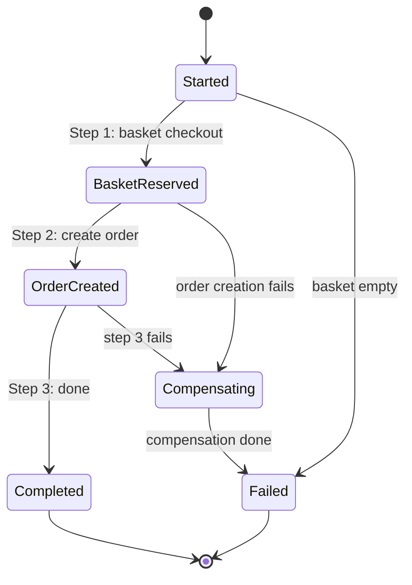
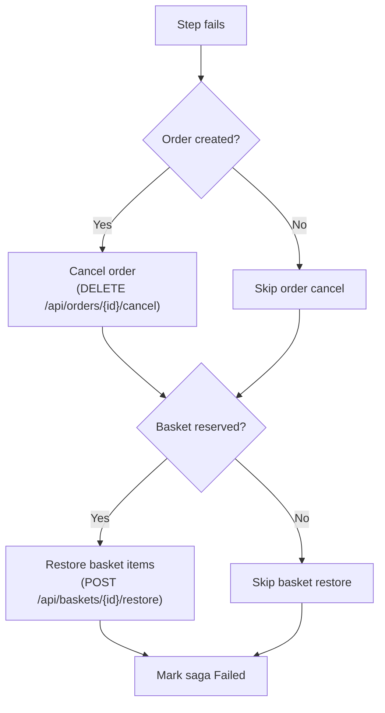

# 🔄 Saga Pattern: Orchestration-Based Checkout with Compensating Transactions

> [!abstract]
> **Core Idea**
>
> The synchronous checkout has a fatal flaw: if Baskets succeeds but Orders fails, the basket is cleared with no order created. The **saga pattern** fixes this by tracking state, executing steps in order, and running **compensating transactions** in reverse on failure. This note shows the code diff from synchronous → saga, the state machine, and the compensation flow.

---

## 🎯 Learning Objectives

- Understand the **saga orchestration pattern** and why it's needed
- Implement a **state machine** for checkout (Started → BasketReserved → OrderCreated → Completed)
- Design **compensating transactions** (cancel order, restore basket items)
- Persist saga state in a dedicated `SagaDbContext` for observability
- Capture a **basket snapshot** at checkout for compensation

---

## 🧩 Main Concepts

### 1. The Saga Pattern

#### Definition

A **saga** is a sequence of local transactions where each step has a **compensating transaction** that undoes its effects. If any step fails, the saga runs compensating actions in reverse order to restore the system to a consistent state.

#### Why It Exists

In a distributed system, you can't use a database transaction across services. If Baskets clears the basket and Orders fails to create the order, there's no automatic rollback. The saga pattern provides **application-level compensation** instead.

#### Problem It Solves

Data inconsistency from partial failures. Without a saga, the BFF's synchronous checkout leaves the basket cleared but no order created when Orders is down.

---

### 2. Saga State Machine



#### State Definitions

| State | Meaning |
|-------|---------|
| `Started` | Saga created, about to checkout basket |
| `BasketReserved` | Basket checked out, items captured as snapshot |
| `OrderCreated` | Order submitted successfully |
| `Completed` | All steps done, saga succeeded |
| `Compensating` | A step failed, running compensating actions in reverse |
| `Failed` | Compensation complete (or compensation itself failed) |

---

### 3. Code Diff: Synchronous Checkout vs Saga

**Before (synchronous):**

```csharp
// ❌ No state tracking, no compensation
app.MapPost("/api/baskets/{customerId}/checkout", async (string customerId, IBasketsClient baskets, IOrdersClient orders) =>
{
    var items = await baskets.CheckoutAsync(customerId);  // Basket cleared
    var order = await orders.SubmitOrderAsync(items);     // If this fails → basket lost!
    return Results.Ok(new { order, items });
});
```

**After (saga):**

```csharp
// ✅ State tracked, compensation on failure
app.MapPost("/api/baskets/{customerId}/checkout", async (string customerId, CheckoutSagaOrchestrator saga) =>
{
    var sagaId = await saga.StartAsync(customerId);
    return Results.Ok(new { sagaId, status = "Started" });
});

// CheckoutSagaOrchestrator
public class CheckoutSagaOrchestrator
{
    public async Task<Guid> StartAsync(string customerId)
    {
        var state = new SagaState
        {
            Id = Guid.NewGuid(),
            CustomerId = customerId,
            Status = SagaStatus.Started,
            StartedAt = DateTime.UtcNow
        };
        _db.Sagas.Add(state);
        await _db.SaveChangesAsync();

        await ExecuteStep1Async(state);  // Basket checkout
        if (state.Status == SagaStatus.BasketReserved)
            await ExecuteStep2Async(state);  // Create order
        if (state.Status == SagaStatus.OrderCreated)
            await ExecuteStep3Async(state);  // Mark completed

        if (state.Status == SagaStatus.Compensating)
            await CompensateAsync(state);

        return state.Id;
    }
}
```

---

### 4. Compensating Transactions

#### Definition

A **compensating transaction** undoes the effect of a completed step. If the order was created but step 3 fails, the saga cancels the order and restores basket items.

#### Compensation Flow



#### Implementation

```csharp
private async Task CompensateAsync(SagaState state)
{
    state.Status = SagaStatus.Compensating;
    state.ErrorMessage = "Step failed, compensating...";

    // Reverse order: cancel order first (if created), then restore basket
    if (state.OrderId is not null)
    {
        try { await _orders.CancelOrderAsync(state.OrderId.Value); }
        catch (Exception ex) { _logger.LogWarning(ex, "Order cancel failed"); }
    }

    if (state.BasketSnapshotJson is not null)
    {
        try { await _baskets.RestoreBasketAsync(state.CustomerId, snapshot); }
        catch (Exception ex) { _logger.LogWarning(ex, "Basket restore failed"); }
    }

    state.Status = SagaStatus.Failed;
    state.CompletedAt = DateTime.UtcNow;
    await _db.SaveChangesAsync();
}
```

> [!warning]
> Compensation is **best-effort**. If a compensating action itself fails (e.g., Baskets service also down), the saga logs the error and still marks itself as Failed. Production systems would need retry/dead-letter queues.

---

### 5. Basket Snapshot for Compensation

#### Definition

When the saga checks out the basket, it captures a **JSON snapshot** of the basket items. This snapshot is used to restore the basket if compensation is needed.

```csharp
// In SagaState entity
public string? BasketSnapshotJson { get; set; }

// At checkout time
state.BasketSnapshotJson = JsonSerializer.Serialize(items);
```

> [!tip]
> The snapshot keeps the saga state **self-contained** — no need to query the Baskets service during compensation. The items are already in the saga's own database.

---

## 🛠️ Implementation Process

### Step 1 — Add compensating actions to downstream services
- Baskets: `POST /api/baskets/{customerId}/restore` (re-adds items from snapshot)
- Orders: `DELETE /api/orders/{id}/cancel` (sets status to "Cancelled")

### Step 2 — Create saga state model
`SagaState` entity (Id, CustomerId, Status, BasketSnapshotJson, OrderId, ErrorMessage, timestamps) + `SagaStatus` enum

### Step 3 — Create SagaDbContext
EF Core InMemory, `DbSet<SagaState>`

### Step 4 — Create CheckoutSagaOrchestrator
3-step saga with compensation on failure

### Step 5 — Replace BFF checkout endpoint
`POST /api/baskets/{customerId}/checkout` now starts the saga

### Step 6 — Add saga inspection endpoint
`GET /api/sagas/{id}` — returns saga state with snapshot for debugging

---

## 📊 Key Decisions

| Decision | Choice | Why |
|----------|--------|-----|
| Enum name | `SagaStatus` (not `SagaState`) | Avoids collision with `SagaState` entity class |
| Basket snapshot | JSON in saga DB | Self-contained, no re-query needed during compensation |
| Compensation | Best-effort | If compensation fails, log and mark Failed |
| Saga DB location | In BFF service | Keeps demo simple — no separate saga service |
| State persistence | EF Core InMemory | Demo only — production would use SQL Server/PostgreSQL |

---

## ✅ Testing & Verification

- [x] `dotnet build EcommerceDemo.slnx` — 0 errors, 0 warnings
- [x] Full stack verification (Docker Compose with saga failure simulation) — verified in [[11-docker-compose-and-containerization]]

---

## 📎 See Also

- [[08-backend-for-frontend-pattern]] — Synchronous checkout (the "before" that saga replaces)
- [[04-basket-operations-and-event-consumer]] — Basket restore endpoint (compensating action)
- [[06-order-submission-and-events]] — Order cancel endpoint (compensating action)
- [[11-docker-compose-and-containerization]] — Docker Compose for full stack testing

---

