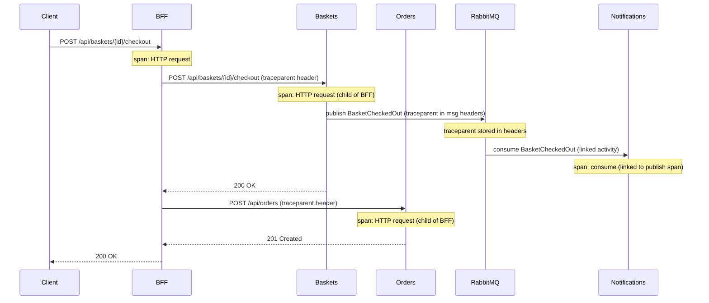

# 🔍 Distributed Tracing: OpenTelemetry + Jaeger

> [!abstract]
> **Core Idea**
>
> In a microservices system, a single user request spans multiple services and crosses an async messaging boundary (RabbitMQ). **Distributed tracing** with OpenTelemetry + Jaeger lets you see the entire request as a single trace tree — HTTP calls, RabbitMQ publishes, and consumer processing all linked by the W3C `traceparent` header.

---

## 🎯 Learning Objectives

- Register **OpenTelemetry SDK** in all services with a shared extension method
- Understand how **W3C traceparent** propagates across HTTP and RabbitMQ boundaries
- Export traces to **Jaeger** via OTLP
- See a single checkout produce a trace spanning BFF → Baskets → Orders → RabbitMQ → Notifications

---

## 🧩 Main Concepts

### 1. Distributed Tracing Fundamentals

#### Definition

**Distributed tracing** tracks a single user request as it flows through multiple services. Each service contributes a **span** (a unit of work), and spans are linked into a **trace tree** by a shared trace ID.

#### Why It Exists

Without tracing, debugging a slow checkout means checking logs in BFF, Baskets, Orders, and Notifications separately — with no way to correlate them. Tracing links all the logs into one visual tree.

#### Problem It Solves

The "where did it go wrong?" problem. With tracing, you open Jaeger, find the checkout trace, and immediately see which service is slow or failing.

---

### 2. Trace Propagation Across Boundaries

#### How It Works



> [!info]
> The trace crosses the **async messaging boundary** because `EventPublisher` injects the W3C `traceparent` header into RabbitMQ message properties, and `EventConsumer` extracts it to create a **linked activity**. This was built in [[01-solution-scaffolding-and-contracts]] — this ticket just wires up the SDK.

---

### 3. Shared OpenTelemetry Registration

#### Definition

A single `AddOpenTelemetryTracing()` extension method in Contracts ensures all 6 services are instrumented consistently. Each service calls one line in `Program.cs`.

#### Implementation

```csharp
// Contracts/Messaging/OpenTelemetryExtensions.cs
public static class OpenTelemetryExtensions
{
    public static IServiceCollection AddOpenTelemetryTracing(
        this IServiceCollection services, IConfiguration config)
    {
        services.AddOpenTelemetry()
            .WithTracing(tracing =>
            {
                tracing
                    .AddAspNetCoreInstrumentation()      // Incoming HTTP
                    .AddHttpClientInstrumentation()       // Outgoing HTTP (BFF → downstream)
                    .AddSource("RabbitMQ")               // Custom ActivitySource from EventPublisher/Consumer
                    .AddOtlpExporter(otlp =>
                    {
                        otlp.Endpoint = new Uri(
                            config["OTEL_EXPORTER_OTLP_ENDPOINT"]
                            ?? "http://localhost:4317");
                    });
            });

        return services;
    }
}
```

#### Registration in each service:

```csharp
// In every service's Program.cs
builder.Services.AddOpenTelemetryTracing(builder.Configuration);
```

#### Configuration in appsettings.json:

```json
{
  "OTEL_SERVICE_NAME": "bff",
  "OTEL_EXPORTER_OTLP_ENDPOINT": "http://localhost:4317"
}
```

> [!tip]
> Packages are in Contracts only — NuGet PackageReference flows transitively through project references. This means 4 packages in one place, not 24 `<PackageReference>` lines across 6 .csproj files.

---

### 4. What Gets Instrumented

| Instrumentation | What It Traces | Package |
|-----------------|----------------|--------|
| `AddAspNetCoreInstrumentation` | Incoming HTTP requests | `OpenTelemetry.Instrumentation.AspNetCore` |
| `AddHttpClientInstrumentation` | Outgoing HTTP calls (BFF → downstream) | `OpenTelemetry.Instrumentation.Http` |
| `AddSource("RabbitMQ")` | Custom spans from `EventPublisher`/`EventConsumer` | (uses ActivitySource from ) |
| `AddOtlpExporter` | Exports traces to Jaeger via OTLP gRPC | `OpenTelemetry.Exporter.OpenTelemetryProtocol` |

---

## 🛠️ Implementation Process

### Step 1 — Add OpenTelemetry packages to Contracts
4 packages: Extensions.Hosting, AspNetCore, Http, Exporter.OpenTelemetryProtocol (all 1.18.0)

### Step 2 — Create shared extension method
`AddOpenTelemetryTracing()` in `Contracts/Messaging/OpenTelemetryExtensions.cs`

### Step 3 — Register in all 6 services
One line per service: `builder.Services.AddOpenTelemetryTracing(builder.Configuration)`

### Step 4 — Add config to all 6 appsettings.json
`OTEL_SERVICE_NAME` (unique per service) + `OTEL_EXPORTER_OTLP_ENDPOINT`

### Step 5 — Add Jaeger container (done in [[11-docker-compose-and-containerization]])
`jaegertracing/all-in-one:1.62` with `COLLECTOR_OTLP_ENABLED=true`, ports 16686 (UI) + 4317 (OTLP)

---

## 📊 Key Decisions

| Decision | Choice | Why |
|----------|--------|-----|
| Packages in Contracts | Not per-service | Transitive flow — one place to manage versions |
| Shared extension method | `AddOpenTelemetryTracing()` | Consistent instrumentation across all services |
| Config via appsettings + env vars | `OTEL_SERVICE_NAME`, `OTEL_EXPORTER_OTLP_ENDPOINT` | Local dev: localhost:4317, Docker: jaeger:4317 |
| Sampling | Default (AlwaysOn) | Demo traffic is low — no explicit sampler needed |

---

## ✅ Testing & Verification

- [x] Build verification — 0 errors, 0 warnings
- [x] Full stack verification (Docker Compose + Jaeger) — verified in [[11-docker-compose-and-containerization]]
- [x] Trace visibility in Jaeger UI — Jaeger container added in [[11-docker-compose-and-containerization]]

---

## 📎 See Also

- [[01-solution-scaffolding-and-contracts]] — Traceparent injection/extraction built here (EventPublisher + EventConsumer)
- [[11-docker-compose-and-containerization]] — Jaeger container + OTLP endpoint configuration
- [[12-api-documentation]] — README with Jaeger UI access instructions

---

