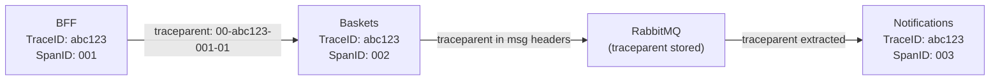
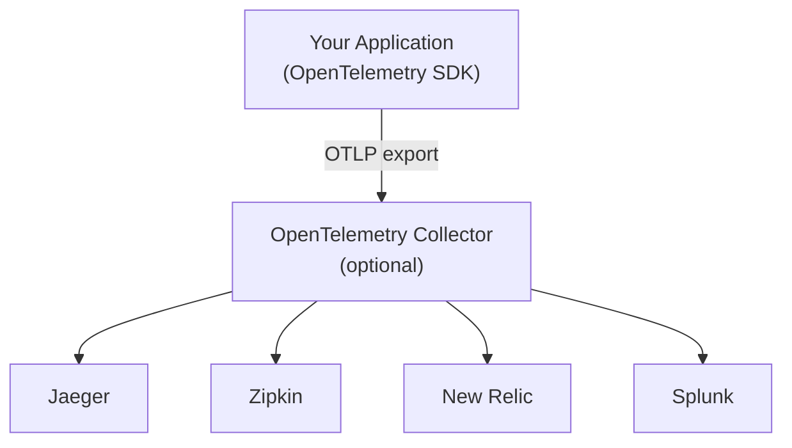
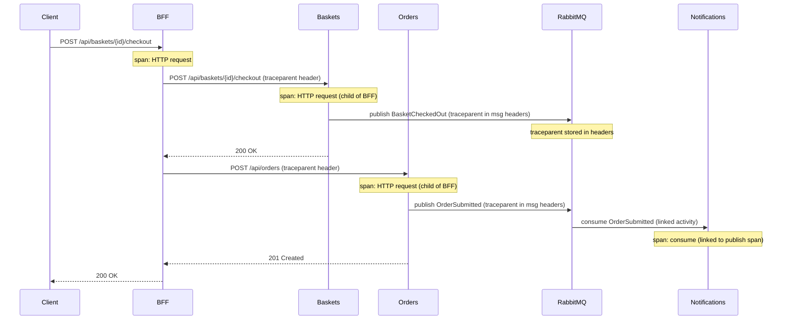

# 🔍 Distributed Tracing: OpenTelemetry + Jaeger

> [!abstract]
> **Core Idea**
>
> In a microservices system, a single user request spans multiple services and crosses an async messaging boundary (RabbitMQ). **Distributed tracing** tracks the end-to-end journey of that request as a **trace** — a tree of **spans** linked by a shared **Trace ID**. **OpenTelemetry** is the vendor-neutral framework for instrumenting applications, and **Jaeger** is the open-source tool used to visualize the traces. This note covers the core concepts (traces, spans, correlation context), the tooling landscape (OpenTelemetry, Jaeger, Zipkin, APM platforms), best practices (avoiding vendor lock-in, logs vs traces), and a concrete implementation using OpenTelemetry + Jaeger with W3C `traceparent` propagation across HTTP and RabbitMQ.

---

## 🎯 Learning Objectives

- Understand **traces and spans** — the fundamental building blocks of distributed tracing
- Understand **correlation context** — how a Trace ID propagates across services to stitch spans into a coherent flow
- Understand **OpenTelemetry** as a vendor-neutral instrumentation framework
- Know the **tooling landscape** — Jaeger, Zipkin for visualization; New Relic, Splunk for APM; Micrometer for metrics
- Apply **best practices** — avoiding vendor lock-in, understanding logs vs traces
- Register **OpenTelemetry SDK** in all services with a shared extension method
- Understand how **W3C traceparent** propagates across HTTP and RabbitMQ boundaries
- Export traces to **Jaeger** via OTLP
- See a single checkout produce a trace spanning BFF → Baskets → Orders → RabbitMQ → Notifications

---

## 🧩 Main Concepts

### 1. Traces and Spans: The Building Blocks

#### Definition

A **trace** represents the end-to-end journey of a single request through a distributed system. It is composed of multiple **spans**, where each span captures a specific operation or task within a service — an HTTP request, a database query, a message publish, or a message consume.

```
Trace (checkout request)
├── Span: BFF — POST /api/baskets/{id}/checkout
│   ├── Span: Baskets — POST /api/baskets/{id}/checkout
│   │   └── Span: RabbitMQ — publish BasketCheckedOut
│   └── Span: Orders — POST /api/orders
│       └── Span: RabbitMQ — publish OrderSubmitted
└── Span: Notifications — consume OrderSubmitted (linked)
```

`BasketCheckedOut` is published but has no consumer queue in the current topology. Notifications consumes `OrderSubmitted` and `ProductChanged`.

#### Why It Exists

In a monolith, a single stack trace shows the full call chain. In microservices, the call chain is split across processes — there's no single stack trace. Traces reconstruct that call chain by linking spans across service boundaries.

#### Problem It Solves

The "where did it go wrong?" problem. Without tracing, debugging a slow checkout means checking logs in BFF, Baskets, Orders, and Notifications separately — with no way to correlate them. With tracing, you open Jaeger, find the checkout trace, and immediately see which service is slow or failing.

> [!info]
> Each span has a **start time, duration, operation name, and tags** (key-value metadata like HTTP status code, routing key, etc.). The collection of spans forms a tree — each span has a parent span (except the root).

---

### 2. Correlation Context: How Spans Link Together

#### Definition

A unique **Trace ID** (also called a correlation identifier) is propagated across services. This allows the system to stitch together parent and child spans into a coherent flow — even across async boundaries like message queues.

#### How It Works

The W3C **traceparent** header carries three pieces of information:
- **Trace ID** — shared by all spans in the same trace
- **Span ID** — unique per span, identifies the parent of the next span
- **Sampling flag** — whether this trace should be recorded



> [!tip]
> The Trace ID is the **correlation key**. Every service in the request chain shares the same Trace ID. When you search Jaeger by Trace ID, you see the entire request flow — HTTP calls, RabbitMQ messages, and consumer processing — as one tree.

---

### 3. OpenTelemetry: The Vendor-Neutral Framework

#### Definition

**OpenTelemetry** is a vendor-neutral framework for instrumenting applications to collect and export telemetry data (traces, metrics, logs) consistently. It's a CNCF project that merged OpenTracing and OpenCensus.

#### Why It Exists

Before OpenTelemetry, each monitoring vendor (New Relic, Datadog, Splunk) had its own instrumentation library. If you switched vendors, you had to re-instrument your entire codebase. OpenTelemetry provides a single, standard API — you instrument once, and export to any backend.

#### Problem It Solves

**Vendor lock-in**. With OpenTelemetry, you write instrumentation code once. To switch from Jaeger to Zipkin to New Relic, you only change the exporter configuration — not the instrumentation code.



> [!info]
> OpenTelemetry is **not a monitoring backend** — it's the instrumentation layer. The backend (Jaeger, Zipkin, New Relic, etc.) is separate. You can change backends without touching application code.

---

### 4. The Tooling Landscape

#### Visualization Tools (Open Source)

| Tool | Type | What It Shows |
|------|------|---------------|
| **Jaeger** | Distributed tracing UI | Trace trees, span timing, service dependency maps |
| **Zipkin** | Distributed tracing UI | Similar to Jaeger — alternative open-source option |

#### APM and Metrics Platforms (Commercial)

| Tool | Type | What It Offers |
|------|------|----------------|
| **New Relic** | APM (Application Performance Monitoring) | End-to-end monitoring, alerts, dashboards |
| **Splunk** | APM + Log management | Comprehensive monitoring, log aggregation, metrics |
| **Micrometer** | Metrics library | Application metrics (JVM, HTTP, custom) — not traces |

> [!tip]
> This project uses **Jaeger** (`jaegertracing/all-in-one:1.62.0`) because it's free, open-source, and has a great UI for visualizing trace trees. In production, you'd use a managed APM platform (New Relic, Datadog) for alerting and long-term storage.

---

### 5. Best Practices

#### Avoiding Vendor Lock-In

> [!warning]
> If you instrument directly with a vendor's SDK (e.g., `NewRelic.Api.Agent`), switching to another platform means re-instrumenting your entire codebase. **OpenTelemetry avoids this** — you instrument once with the OpenTelemetry API, and switch backends by changing the exporter.

| Approach | Vendor Lock-in | Flexibility |
|----------|---------------|-------------|
| Direct vendor SDK (e.g., New Relic) | ❌ High | Low — must re-instrument to switch |
| OpenTelemetry + OTLP export | ✅ None | High — change exporter config only |

#### Logs vs Traces

> [!info]
> **Logs** provide details about specific events within a single service (e.g., "Order created for customer X"). **Distributed traces** provide the necessary context for **inter-service interactions** — which service called which, how long each took, and where the failure occurred.

| Aspect | Logs | Distributed Traces |
|--------|------|-------------------|
| Scope | Single service | Cross-service |
| Correlation | Manual (search by timestamp/request ID) | Automatic (shared Trace ID) |
| Best for | "What happened in this service?" | "Where did this request go wrong?" |
| Overhead | Low | Medium (instrumentation + export) |

> [!tip]
> Use **both**. Logs for detailed debugging within a service, traces for understanding the cross-service flow. OpenTelemetry can correlate logs to traces by injecting the Trace ID into log entries.

---

### 6. Trace Propagation Across Boundaries

#### How It Works



> [!info]
> The trace crosses the **async messaging boundary** because `EventPublisher` injects the W3C `traceparent` header into RabbitMQ message properties, and `EventConsumer` extracts it to create a **linked activity**. This was built in [[01-solution-scaffolding-and-contracts]] — this ticket just wires up the SDK.

---

### 7. Shared OpenTelemetry Registration

#### Definition

A single `AddOpenTelemetryTracing()` extension method in Contracts ensures all 6 services are instrumented consistently. Each service calls one line in `Program.cs`.

#### Implementation

```csharp
// Contracts/Messaging/OpenTelemetryExtensions.cs
public static class OpenTelemetryExtensions
{
    public static IServiceCollection AddOpenTelemetryTracing(
        this IServiceCollection services, IConfiguration config)
    {
        services.AddOpenTelemetry()
            .WithTracing(tracing =>
            {
                tracing
                    .AddAspNetCoreInstrumentation()      // Incoming HTTP
                    .AddHttpClientInstrumentation()       // Outgoing HTTP (BFF → downstream)
                    .AddSource("RabbitMQ")               // Custom ActivitySource from EventPublisher/Consumer
                    .AddOtlpExporter(otlp =>
                    {
                        otlp.Endpoint = new Uri(
                            config["OTEL_EXPORTER_OTLP_ENDPOINT"]
                            ?? "http://localhost:4317");
                    });
            });

        return services;
    }
}
```

#### Registration in each service:

```csharp
// In every service's Program.cs
builder.Services.AddOpenTelemetryTracing(builder.Configuration);
```

#### Configuration in appsettings.json:

```json
{
  "OTEL_SERVICE_NAME": "bff",
  "OTEL_EXPORTER_OTLP_ENDPOINT": "http://localhost:4317"
}
```

> [!tip]
> Packages are in Contracts only — NuGet PackageReference flows transitively through project references. This means 4 packages in one place, not 24 `<PackageReference>` lines across 6 .csproj files.

---

### 8. What Gets Instrumented

| Instrumentation | What It Traces | Package |
|-----------------|----------------|--------|
| `AddAspNetCoreInstrumentation` | Incoming HTTP requests | `OpenTelemetry.Instrumentation.AspNetCore` |
| `AddHttpClientInstrumentation` | Outgoing HTTP calls (BFF → downstream) | `OpenTelemetry.Instrumentation.Http` |
| `AddSource("RabbitMQ")` | Custom spans from `EventPublisher`/`EventConsumer` | (uses ActivitySource from ) |
| `AddOtlpExporter` | Exports traces to Jaeger via OTLP gRPC | `OpenTelemetry.Exporter.OpenTelemetryProtocol` |

---

## 🛠️ Implementation Process

### Step 1 — Add OpenTelemetry packages to Contracts
4 packages: Extensions.Hosting, AspNetCore, Http, Exporter.OpenTelemetryProtocol (all 1.18.0)

### Step 2 — Create shared extension method
`AddOpenTelemetryTracing()` in `Contracts/Messaging/OpenTelemetryExtensions.cs`

### Step 3 — Register in all 6 services
One line per service: `builder.Services.AddOpenTelemetryTracing(builder.Configuration)`

### Step 4 — Add config to all 6 appsettings.json
`OTEL_SERVICE_NAME` (unique per service) + `OTEL_EXPORTER_OTLP_ENDPOINT`

### Step 5 — Add Jaeger container (done in [[11-docker-compose-and-containerization]])
`jaegertracing/all-in-one:1.62.0` with `COLLECTOR_OTLP_ENABLED=true`, ports 16686 (UI) + 4317 (OTLP)

---

## 📊 Key Decisions

| Decision | Choice | Why |
|----------|--------|-----|
| Packages in Contracts | Not per-service | Transitive flow — one place to manage versions |
| Shared extension method | `AddOpenTelemetryTracing()` | Consistent instrumentation across all services |
| Config via appsettings + env vars | `OTEL_SERVICE_NAME`, `OTEL_EXPORTER_OTLP_ENDPOINT` | Local dev: localhost:4317, Docker: jaeger:4317 |
| Sampling | Default (AlwaysOn) | Demo traffic is low — no explicit sampler needed |

---

## ✅ Testing & Verification

- [x] Build verification — 0 errors, 0 warnings
- [x] Full stack verification (Docker Compose + Jaeger) — verified in [[11-docker-compose-and-containerization]]
- [x] Trace visibility in Jaeger UI — Jaeger container added in [[11-docker-compose-and-containerization]]

---

## 📎 See Also

- [[01-solution-scaffolding-and-contracts]] — Traceparent injection/extraction built here (EventPublisher + EventConsumer)
- [[11-docker-compose-and-containerization]] — Jaeger container + OTLP endpoint configuration
- [[12-api-documentation]] — README with Jaeger UI access instructions

---

