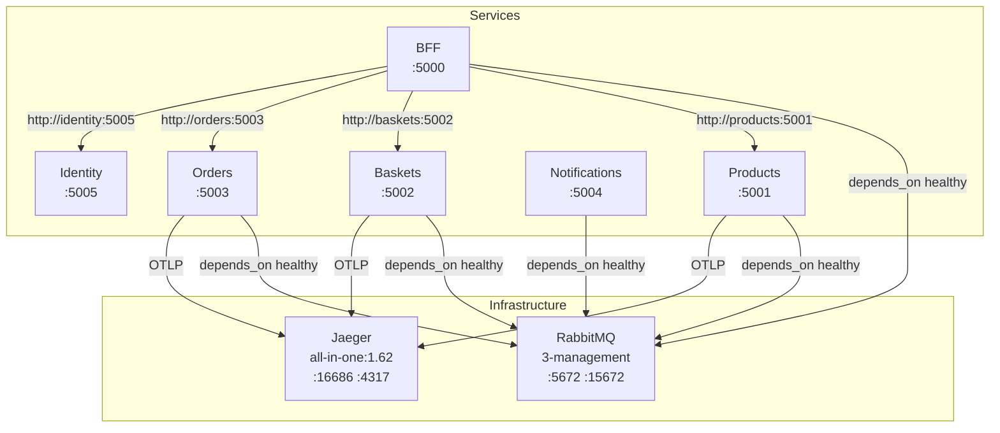

# 🐳 Docker Compose: Containerization + Service Discovery + Healthchecks

> [!abstract]
> **Core Idea**
>
> Docker Compose turns 6 .NET services + RabbitMQ + Jaeger into a single `docker compose up --build` command. This note covers **multi-stage Dockerfiles**, the 8-container topology, **service discovery via container names**, **healthchecks** that prevent services from starting before RabbitMQ is ready, and environment-based configuration.

---

## 🎯 Learning Objectives

- Write **multi-stage Dockerfiles** for .NET services (SDK build → runtime run)
- Design a **Docker Compose topology** with 8 containers
- Use **service discovery via container names** (Docker DNS)
- Add **healthchecks** so services wait for RabbitMQ before connecting
- Configure **environment variables** for RabbitMQ, OpenTelemetry, and downstream URLs

---

## 🧩 Main Concepts

### 1. Multi-Stage Dockerfiles

#### Definition

A **multi-stage Dockerfile** uses one stage to build (SDK image) and another to run (runtime image). The final image is small — it contains only the compiled DLL and the ASP.NET runtime.

#### Implementation

```dockerfile
# Build stage
FROM mcr.microsoft.com/dotnet/sdk:10.0 AS build
WORKDIR /src

# Copy Contracts first (for restore caching)
COPY Contracts/ Contracts/
COPY BFF/ BFF/

RUN dotnet restore BFF/BFF.csproj
RUN dotnet publish BFF/BFF.csproj -c Release -o /app/publish

# Runtime stage
FROM mcr.microsoft.com/dotnet/aspnet:10.0
WORKDIR /app
COPY --from=build /app/publish .
ENTRYPOINT ["dotnet", "BFF.dll"]
```

> [!tip]
> Copying Contracts first means Docker caches the `dotnet restore` layer. If only the BFF code changes, Docker reuses the restored Contracts layer — faster builds.

---

### 2. Docker Compose Topology



---

### 3. Service Discovery via Container Names

#### Definition

Docker Compose creates a DNS entry for each service name. Services reference each other by container name (e.g., `http://products:5001`) instead of IP addresses.

#### Code Diff: Local Dev vs Docker Compose

**Local dev (appsettings.json):**

```json
{
  "Downstream": {
    "ProductsUrl": "http://localhost:5001",
    "BasketsUrl": "http://localhost:5002"
  }
}
```

**Docker Compose (environment variables override):**

```yaml
services:
  bff:
    environment:
      - Downstream__ProductsUrl=http://products:5001
      - Downstream__BasketsUrl=http://baskets:5002
      - Downstream__OrdersUrl=http://orders:5003
      - Downstream__IdentityUrl=http://identity:5005
```

> [!info]
> Docker's built-in DNS resolves `products` to the container's IP. No manual host configuration needed — just use the service name as hostname.

---

### 4. Healthchecks

#### Definition

A **healthcheck** tells Docker when a container is ready. Services use `depends_on` with `condition: service_healthy` to wait for RabbitMQ before starting.

```yaml
services:
  rabbitmq:
    image: rabbitmq:3-management
    healthcheck:
      test: ["CMD", "rabbitmq-diagnostics", "-q", "ping"]
      interval: 5s
      timeout: 3s
      retries: 5

  bff:
    depends_on:
      rabbitmq:
        condition: service_healthy
```

> [!warning]
> Without the healthcheck, services start immediately and try to connect to RabbitMQ before it's ready. They'll fail and retry — but with `condition: service_healthy`, Docker waits until RabbitMQ passes the `rabbitmq-diagnostics ping` check before starting dependent services.

---

## 🛠️ Implementation Process

### Step 1 — Create 6 multi-stage Dockerfiles
One per service, all following the same pattern: `sdk:10.0` build → `aspnet:10.0` runtime

### Step 2 — Create docker-compose.yml with 8 services
- `rabbitmq` (3-management, healthcheck, ports 5672+15672)
- `jaeger` (all-in-one:1.62, COLLECTOR_OTLP_ENABLED=true, ports 16686+4317)
- 6 service containers with `depends_on: rabbitmq (service_healthy)`

### Step 3 — Create docker-compose.override.yml
`ASPNETCORE_ENVIRONMENT=Development` + local port bindings

### Step 4 — Create .dockerignore
Exclude `bin/`, `obj/`, `.vs/`, `.git/` from build context

### Step 5 — Configure environment variables per service
- `ASPNETCORE_URLS` — listening port inside container
- `RabbitMq__Host` / `RabbitMq__Port` / `RabbitMq__UserName` / `RabbitMq__Password`
- `OTEL_SERVICE_NAME` + `OTEL_EXPORTER_OTLP_ENDPOINT=http://jaeger:4317`
- `Downstream__*Url` (BFF only) — container names

---

## 📊 Key Decisions

| Decision | Choice | Why |
|----------|--------|-----|
| Port map | BFF=5000, Products=5001, Baskets=5002, Orders=5003, Notifications=5004, Identity=5005 | Consistent, easy to remember |
| Build context | `EcommerceDemo/` directory | Contracts project accessible to all Dockerfiles |
| Service discovery | Container names (Docker DNS) | No manual host config — `http://products:5001` just works |
| Jaeger version | `all-in-one:1.62` | Pinned, with `COLLECTOR_OTLP_ENABLED=true` for OTLP |
| Identity | No RabbitMQ dependency | Identity has no messaging |

---

## ✅ Testing & Verification

- [x] Build verification — `dotnet build EcommerceDemo.slnx` — 0 errors, 0 warnings
- [x] Docker Compose verification — `docker compose up --build` starts all 8 containers

```bash
docker compose up --build
# RabbitMQ management UI: http://localhost:15672 (guest/guest)
# Jaeger UI: http://localhost:16686
# BFF Swagger: http://localhost:5000/swagger
```

---

## 📎 See Also

- [[02-products-service]] — Products service containerized
- [[03-baskets-service]] — Baskets service containerized
- [[04-identity-service]] — Identity service containerized
- [[05-orders-service]] — Orders service containerized
- [[06-notifications-service]] — Notifications service containerized
- [[07-bff-service]] — BFF service containerized
- [[08-saga-orchestration]] — Saga endpoints for full stack testing
- [[09-distributed-tracing]] — OpenTelemetry configuration (Jaeger container)

---

## 📝 Artifacts Created

- `EcommerceDemo/BFF/Dockerfile` — Multi-stage Dockerfile
- `EcommerceDemo/Products/Dockerfile` — Multi-stage Dockerfile
- `EcommerceDemo/Baskets/Dockerfile` — Multi-stage Dockerfile
- `EcommerceDemo/Orders/Dockerfile` — Multi-stage Dockerfile
- `EcommerceDemo/Notifications/Dockerfile` — Multi-stage Dockerfile
- `EcommerceDemo/Identity/Dockerfile` — Multi-stage Dockerfile
- `EcommerceDemo/.dockerignore` — Excludes bin/obj/.vs/.git
- `docker-compose.yml` — 8-service topology
- `docker-compose.override.yml` — Local dev overrides
