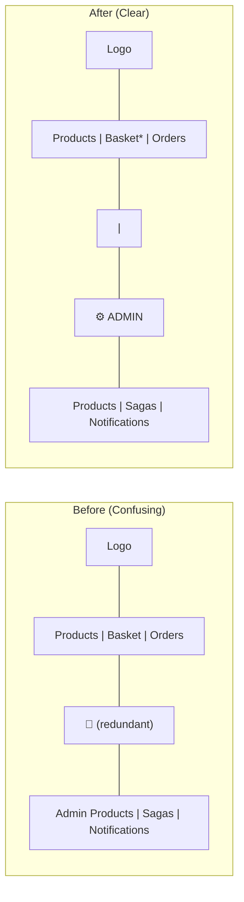
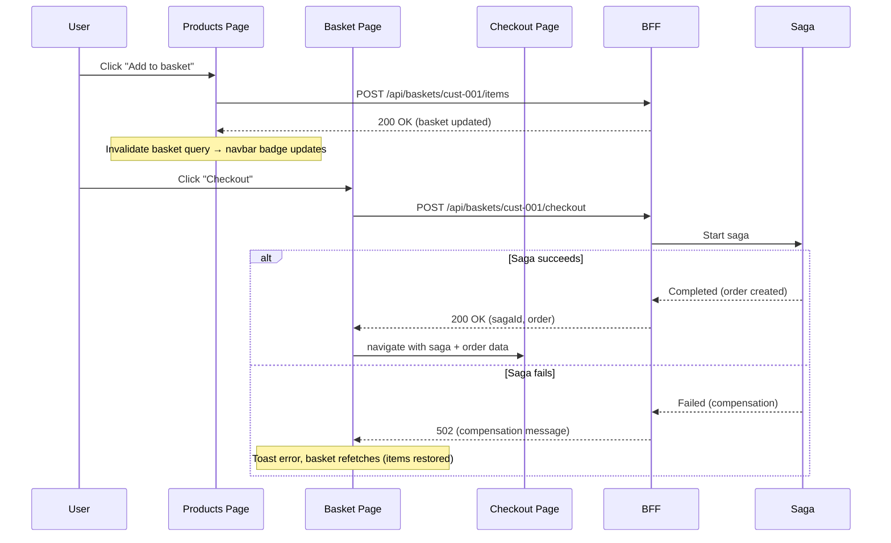

# 🖥️ Frontend Architecture & UI

> [!abstract]
> **Core Idea**
>
> The frontend is a React + Vite + TypeScript SPA that serves as the single client for the entire microservices backend. It provides a customer-facing storefront (product catalog, basket, checkout, order history) and an admin/demo panel (product CRUD, saga state inspector, live event notifications feed). All requests flow through the BFF gateway, except notifications which go directly to the Notifications service. This note covers the frontend architecture, data flow, component structure, and the navbar redesign that fixed a confusing navigation layout.

---

## 🎯 Learning Objectives

- Understand the **frontend architecture** — React SPA, routing, and the BFF gateway pattern from the client side
- Learn how **TanStack Query** manages server state (caching, mutations, invalidation, polling)
- See how **custom hooks** encapsulate all API calls, keeping components clean
- Understand the **shop vs admin** route split and how the navbar visually separates them
- Trace the **product → basket → checkout → order** data flow end-to-end
- See how **saga polling** and **notifications polling** work with `refetchInterval`
- Understand the **navbar redesign** — removing redundancy and adding visual hierarchy

---

## 🧩 Main Concepts

### 1. Tech Stack

| Technology | Purpose |
|-----------|---------|
| React 18 + TypeScript | UI framework with type safety |
| Vite | Build tool + dev server with HMR |
| React Router v6 | Routing (`/shop/*`, `/admin/*`) |
| TanStack Query (React Query) | Server state: caching, mutations, polling |
| shadcn/ui + Radix UI | Accessible component library (Button, Card, Dialog, Table, etc.) |
| Tailwind CSS | Utility-first styling (dark theme) |
| lucide-react | Icon set |
| sonner | Toast notifications |
| nginx | Static file serving + API proxy (Docker) |

---

### 2. Project Structure

```
frontend/src/
├── lib/
│   ├── api.ts              # Typed fetch wrapper — all API endpoints
│   ├── types.ts            # TypeScript interfaces matching backend DTOs
│   ├── constants.ts        # CUSTOMER_ID = 'cust-001'
│   ├── queryClient.ts      # TanStack Query config + global error toasts
│   └── utils.ts            # cn() class merge helper
├── hooks/
│   ├── use-products.ts      # useProducts, useCreateProduct, useUpdateProduct, useDeleteProduct
│   ├── use-basket.ts        # useBasket, useAddBasketItem, useRemoveBasketItem, useCheckout
│   ├── use-orders.ts        # useOrdersByCustomer
│   ├── use-saga.ts          # useSagaState (with polling)
│   ├── use-notifications.ts  # useNotifications (with polling)
│   └── use-customer.ts      # useCustomer
├── components/
│   ├── ui/                  # shadcn/ui components (Button, Card, Dialog, Table, etc.)
│   └── shared/
│       ├── Layout.tsx       # Shell: Navbar + <Outlet />
│       └── Navbar.tsx       # Top navigation bar
├── routes/
│   ├── shop/               # Storefront routes
│   │   ├── products.tsx     # Product grid with "Add to basket"
│   │   ├── basket.tsx       # Basket view with checkout
│   │   ├── checkout.tsx     # Checkout confirmation + saga status
│   │   └── orders.tsx       # Order history (expandable)
│   └── admin/              # Admin/Demo routes
│       ├── products.tsx     # Product CRUD table
│       ├── sagas.tsx        # Saga state inspector
│       └── notifications.tsx # Live event feed
├── App.tsx                 # Router setup
└── main.tsx                # Entry point
```

---

### 3. Routing

```typescript
// App.tsx
<Routes>
  <Route element={<Layout />}>
    <Route path="/" element={<Navigate to="/shop/products" replace />} />
    {/* Shop routes */}
    <Route path="/shop/products" element={<ProductsPage />} />
    <Route path="/shop/basket" element={<BasketPage />} />
    <Route path="/shop/checkout" element={<CheckoutPage />} />
    <Route path="/shop/orders" element={<OrdersPage />} />
    {/* Admin routes */}
    <Route path="/admin/products" element={<AdminProductsPage />} />
    <Route path="/admin/sagas" element={<SagasPage />} />
    <Route path="/admin/notifications" element={<NotificationsPage />} />
    <Route path="*" element={<Navigate to="/shop/products" replace />} />
  </Route>
</Routes>
```

> [!info]
> All routes share the `<Layout />` wrapper which renders the `<Navbar />` and an `<Outlet />` for page content. Unknown routes redirect to the product catalog.

---

### 4. API Layer (`lib/api.ts`)

A single `request<T>()` fetch wrapper handles JSON serialization, error extraction, and 204 No Content:

```typescript
async function request<T>(url: string, options?: RequestInit): Promise<T> {
  const res = await fetch(url, {
    headers: { 'Content-Type': 'application/json', ...options?.headers },
    ...options,
  })
  if (!res.ok) {
    let detail = ''
    try {
      const body = await res.json()
      detail = body.detail ?? body.title ?? body.message ?? JSON.stringify(body)
    } catch { detail = res.statusText }
    throw new Error(detail || `Request failed with status ${res.status}`)
  }
  if (res.status === 204) return undefined as T
  return res.json() as Promise<T>
}
```

Each domain has typed functions:

| Domain | Functions |
|--------|-----------|
| Products | `getProducts`, `getProductById`, `createProduct`, `updateProduct`, `deleteProduct` |
| Basket | `getBasket`, `addBasketItem`, `removeBasketItem`, `checkout` |
| Orders | `getOrderById`, `getOrdersByCustomer`, `submitOrder` |
| Saga | `getSagaById` |
| Identity | `getCustomer` |
| Notifications | `getNotifications` |

> [!tip]
> All requests go to `/api/*` which is proxied by Vite dev server (→ `localhost:5000`) or nginx (→ `bff:5000`). The only exception is `/api/notifications` which goes directly to the Notifications service on port 5004.

---

### 5. TanStack Query — Server State Management

#### Query Client Configuration

```typescript
// queryClient.ts
export const queryClient = new QueryClient({
  queryCache: new QueryCache({
    onError: (error) => toast.error('Request failed', { description: error.message }),
  }),
  mutationCache: new MutationCache({
    onError: (error) => toast.error('Operation failed', { description: error.message }),
  }),
  defaultOptions: {
    queries: { retry: 1, refetchOnWindowFocus: false },
  },
})
```

> [!important]
> Global error handling via `MutationCache` and `QueryCache` means **individual hooks don't need per-mutation error handlers** — toasts fire automatically. Components can still override with specific `onError` callbacks (e.g., saga 502 → compensation toast).

#### Query Keys

```typescript
export const queryKeys = {
  products: ['products'] as const,
  product: (id: string) => ['products', id] as const,
  basket: (customerId: string) => ['basket', customerId] as const,
  orders: (customerId: string) => ['orders', customerId] as const,
  order: (id: string) => ['orders', id] as const,
  saga: (id: string) => ['saga', id] as const,
  notifications: ['notifications'] as const,
  customer: ['customer'] as const,
}
```

#### Mutation + Invalidation Pattern

When a mutation succeeds, it **invalidates** related queries so the cache refetches:

```typescript
// use-basket.ts — addBasketItem mutation
onSuccess: () => {
  queryClient.invalidateQueries({ queryKey: queryKeys.basket(CUSTOMER_ID) })
}
```

This is why the navbar basket badge updates instantly after adding an item — the `useBasket()` query in the navbar is invalidated and refetches.

---

### 6. Custom Hooks — Encapsulating API Logic

Each domain has a hook file that wraps TanStack Query:

| Hook | Query/Mutation | Key Behavior |
|------|----------------|--------------|
| `useProducts` | Query | Fetches all products, cached |
| `useCreateProduct` | Mutation | Invalidates `products` on success |
| `useUpdateProduct` | Mutation | Invalidates `products` on success |
| `useDeleteProduct` | Mutation | Invalidates `products` on success |
| `useBasket` | Query | Fetches basket by customer ID |
| `useAddBasketItem` | Mutation | Invalidates `basket` on success |
| `useRemoveBasketItem` | Mutation | Invalidates `basket` on success |
| `useCheckout` | Mutation | Invalidates `basket` + `orders` on success |
| `useOrdersByCustomer` | Query | Fetches orders by customer ID |
| `useSagaState` | Query | Polls every 2s while non-terminal, stops on Completed/Failed |
| `useNotifications` | Query | Polls every 3s, caps to latest 50 events |
| `useCustomer` | Query | Fetches fake customer (cust-001) |

> [!tip]
> The saga hook uses conditional `refetchInterval` — it polls while the saga is in a non-terminal state (Started, BasketReserved, OrderCreated, Compensating) and stops when it reaches Completed or Failed.

---

### 7. Navbar Redesign — Fixing the Confusing View

#### The Problem

The original navbar had several UX issues:

1. **Redundant standalone cart icon** — a separate `ShoppingCart` icon sat between the shop links and admin links, duplicating the "Basket" nav item
2. **"Products" appeared twice** — once in shop links, once in admin links, with no visual distinction between the two sections
3. **No visual separation** — shop and admin sections were separated only by an `ml-auto` spacer, making it unclear which links belonged to which section
4. **"Admin" label was too subtle** — small text with no background, easily overlooked

#### The Fix



Key changes:

| Change | Before | After |
|--------|--------|-------|
| Standalone cart icon | Separate `ShoppingCart` NavLink between sections | **Removed** — badge moved to Basket link |
| Basket item count badge | On standalone cart icon | On the **Basket** nav link itself |
| Shop/Admin separation | `ml-auto` spacer only | **Vertical divider** (`h-6 w-px bg-border`) |
| Admin label | Plain text, no background | **Pill badge** with `bg-muted`, uppercase, `Settings` icon |
| Admin label position | Inline with links | **Before** the divider, clearly marking the section |

```typescript
{/* Shop section */}
<nav className="flex items-center gap-1">
  {shopLinks.map((link) => (
    <NavLink key={link.to} to={link.to} className={...}>
      <link.icon className="h-4 w-4" />
      {link.label}
      {/* Badge on the Basket link itself */}
      {link.to === '/shop/basket' && itemCount > 0 && (
        <span className="absolute -right-1 -top-1 ...">
          {itemCount}
        </span>
      )}
    </NavLink>
  ))}
</nav>

<div className="ml-auto" />

{/* Admin section — visually separated */}
<div className="flex items-center gap-1">
  <span className="... bg-muted ... uppercase ...">
    <Settings className="h-3.5 w-3.5" /> Admin
  </span>
  <div className="mx-1 h-6 w-px bg-border" />
  <nav className="flex items-center gap-1">
    {adminLinks.map((link) => (
      <NavLink key={link.to} to={link.to} className={...}>
        <link.icon className="h-4 w-4" />
        {link.label}
      </NavLink>
    ))}
  </nav>
</div>
```

> [!success]
> The redesigned navbar eliminates redundancy (no duplicate cart icon), moves the badge to the Basket link where users expect it, and uses a **pill badge + vertical divider** to clearly separate Shop from Admin sections.

---

### 8. Pages Overview

#### Storefront (`/shop/*`)

| Page | Route | Key Features |
|------|-------|--------------|
| Product Catalog | `/shop/products` | Grid of product cards, quantity selector, "Add to basket" button |
| Shopping Basket | `/shop/basket` | Item list with remove buttons, total, checkout button |
| Checkout Confirmation | `/shop/checkout` | Saga state badge, order summary, navigation links |
| Order History | `/shop/orders` | Expandable order cards with items, status badges, totals |

#### Admin (`/admin/*`)

| Page | Route | Key Features |
|------|-------|--------------|
| Product Management | `/admin/products` | CRUD table with create/edit dialog, delete confirmation |
| Saga State Inspector | `/admin/sagas` | Input saga ID, visual state machine, basket snapshot, error details |
| Live Notifications | `/admin/notifications` | Polling feed of RabbitMQ events, color-coded by type, expandable payloads |

---

### 9. Data Flow — Product → Basket → Checkout → Order



---

### 10. Error Handling

| Scenario | HTTP Status | Behavior |
|----------|-------------|----------|
| Service down | 503 | Global toast: "Service is unreachable", retry button |
| Saga failure | 502 | Compensation toast, basket auto-refetches (items restored) |
| Network error | — | TanStack Query retry (1 attempt), then error state with retry |
| Not found | 404 | "Not found" state in component |
| Mutation error | 4xx/5xx | Global toast with error detail from response body |

> [!danger]
> On saga failure (502), the basket items are **restored by saga compensation**. The frontend refetches the basket query to show the restored items. This is the key demonstration of the [[09-saga-pattern-with-compensation]] pattern from the client side.

---

### 11. Docker Integration

#### Dockerfile (multi-stage)

```dockerfile
# Stage 1: Build
FROM node:20-alpine AS build
WORKDIR /app
COPY package*.json ./
RUN npm ci
COPY . .
RUN npm run build

# Stage 2: Serve
FROM nginx:alpine
COPY --from=build /app/dist /usr/share/nginx/html
COPY nginx.conf /etc/nginx/conf.d/default.conf
EXPOSE 80
```

#### nginx.conf — API Proxy

- `location /api/notifications/` → `proxy_pass http://$notifications_host:5004`
- `location /api/` → `proxy_pass http://$bff_host:5000`
- SPA fallback: `try_files $uri $uri/ /index.html`
- Uses Docker's internal DNS (`resolver 127.0.0.11 valid=10s;`)

#### Vite Dev Proxy

- `/api/notifications` → `http://localhost:5004`
- `/api` → `http://localhost:5000`

---

## 🛠️ Implementation Process

### Step 1 — Scaffold Vite + React + TypeScript project
### Step 2 — Install dependencies (React Router, TanStack Query, shadcn/ui, Tailwind, lucide-react, sonner)
### Step 3 — Set up `lib/api.ts` with typed fetch wrapper and all endpoint functions
### Step 4 — Set up `lib/queryClient.ts` with global error handling via MutationCache/QueryCache
### Step 5 — Create custom hooks (`use-products`, `use-basket`, `use-orders`, `use-saga`, `use-notifications`, `use-customer`)
### Step 6 — Build shared components (`Layout`, `Navbar`)
### Step 7 — Build shop routes (products, basket, checkout, orders)
### Step 8 — Build admin routes (products CRUD, saga inspector, notifications feed)
### Step 9 — Configure Vite dev proxy and nginx.conf for Docker
### Step 10 — Redesign navbar to fix confusing layout (remove redundant cart icon, add visual separation)

---

## 📊 Key Decisions

| Decision | Choice | Why |
|----------|--------|-----|
| Framework | React 18 + TypeScript | Type safety, ecosystem maturity |
| Server state | TanStack Query | Caching, mutations, polling — no Redux needed |
| Component library | shadcn/ui + Radix UI | Accessible, customizable, copy-paste components |
| Styling | Tailwind CSS | Utility-first, dark theme, rapid iteration |
| Client state | React Query only | No Zustand needed — all state is server state |
| Notifications | Polling (not WebSocket) | Simpler, sufficient for demo |
| Navbar badge | On Basket link | Eliminates redundant standalone cart icon |
| Admin separation | Pill badge + divider | Clear visual hierarchy between Shop and Admin |

---

## ✅ Testing & Verification

- [x] `npm run build` — 0 TypeScript errors, Vite build succeeds
- [x] Storefront flow: browse → add to basket → checkout → view order
- [x] Admin flow: create/edit/delete products, inspect saga state, view notifications
- [x] Saga failure: stop orders container, checkout, observe compensation + basket restoration
- [x] Navbar: basket badge on Basket link, clear Shop/Admin separation, no redundant icons

---

## 📎 See Also

- [[08-backend-for-frontend-pattern]] — BFF gateway that the frontend calls
- [[04-basket-operations-and-event-consumer]] — Basket API endpoints consumed by the frontend
- [[06-order-submission-and-events]] — Order API endpoints consumed by the frontend
- [[09-saga-pattern-with-compensation]] — Saga state inspector polls this
- [[07-event-driven-consumer-pattern]] — Notifications feed displays these events
- [[11-docker-compose-and-containerization]] — Frontend containerized with nginx
- [[12-api-documentation]] — API endpoints the frontend consumes

---
