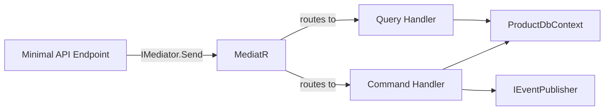

# 📦 Products Service: CQRS with MediatR + EF Core + Integration Events

> [!abstract]
> **Core Idea**
>
> The Products service is the first real microservice. It demonstrates **CQRS with MediatR** (separate command/query handlers), **EF Core InMemory** with seed data, full **CRUD endpoints** via Minimal API, **integration event publishing** (`ProductChanged`) to RabbitMQ, and **Swagger UI** for interactive testing.

---

## 🎯 Learning Objectives

- Apply the **CQRS pattern** using MediatR — separate command (write) and query (read) handlers
- Set up **EF Core InMemory** with seed data for rapid prototyping
- Publish **integration events** on state changes (create/update/delete)
- Add **Swagger UI** with OpenAPI metadata on Minimal API endpoints
- Implement **best-effort event publishing** (graceful degradation when RabbitMQ is unavailable)

---

## 🧩 Main Concepts

### 1. CQRS with MediatR

#### Definition

**CQRS** (Command Query Responsibility Segregation) separates read operations (queries) from write operations (commands). **MediatR** is a .NET library that implements the mediator pattern, routing requests to handlers without direct coupling.

#### Why It Exists

In a traditional CRUD service, a single service class handles both reads and writes. As the service grows, this class becomes a "God Class" — doing too much, hard to test, hard to reason about. CQRS splits this into focused handlers.

#### Problem It Solves

Tight coupling between the caller and the handler. Without MediatR, the API endpoint directly instantiates a service and calls a method. With MediatR, the endpoint sends a request object, and MediatR routes it to the correct handler — the endpoint doesn't know which handler exists.

#### How It Works



#### Implementation

**Step 1 — Define commands and queries as records:**

```csharp
// Query (read)
public record GetProductsQuery : IRequest<List<Product>>;
public record GetProductByIdQuery(Guid Id) : IRequest<Product?>;

// Command (write)
public record CreateProductCommand(string Name, decimal Price, string Category) 
    : IRequest<Product>;
public record UpdateProductCommand(Guid Id, string Name, decimal Price, string Category) 
    : IRequest<Product>;
public record DeleteProductCommand(Guid Id) : IRequest;
```

**Step 2 — Implement handlers:**

```csharp
public class CreateProductHandler : IRequestHandler<CreateProductCommand, Product>
{
    private readonly ProductDbContext _db;
    private readonly IEventPublisher _publisher;

    public async Task<Product> Handle(CreateProductCommand cmd, CancellationToken ct)
    {
        var product = new Product { Name = cmd.Name, Price = cmd.Price, Category = cmd.Category };
        _db.Products.Add(product);
        await _db.SaveChangesAsync(ct);

        // Best-effort event publishing
        try
        {
            await _publisher.PublishAsync("amq.topic", "product.changed",
                new ProductChanged(product.Id, product.Name, product.Price, "created"));
        }
        catch (Exception ex)
        {
            _logger.LogWarning(ex, "RabbitMQ unavailable — event not published");
        }

        return product;
    }
}
```

> [!tip]
> The `try-catch` around `PublishAsync` is intentional for the demo. It lets the service run locally without RabbitMQ. In production, use an outbox pattern or retry policies.

**Step 3 — Wire up in Program.cs:**

```csharp
builder.Services.AddMediatR(cfg => cfg.RegisterServicesFromAssemblyContaining<Program>());
```

---

### 2. EF Core InMemory with Seed Data

#### Definition

**EF Core InMemory** is a database provider that stores data in memory. It's perfect for testing and demos — no SQL Server needed.

#### Implementation

```csharp
public class ProductDbContext : DbContext
{
    public DbSet<Product> Products => Set<Product>();
    public ProductDbContext(DbContextOptions<ProductDbContext> options) : base(options) { }
}

// Registration
builder.Services.AddDbContext<ProductDbContext>(opt =>
    opt.UseInMemoryDatabase("ProductsDb"));
```

**Seeder (runs on startup):**

```csharp
public static class ProductDbSeeder
{
    public static async Task SeedAsync(ProductDbContext db)
    {
        if (await db.Products.AnyAsync()) return;

        db.Products.AddRange(
            new Product { Name = "Wireless Mouse", Price = 29.99m, Category = "Peripherals" },
            new Product { Name = "Mechanical Keyboard", Price = 89.99m, Category = "Peripherals" },
            new Product { Name = "USB-C Hub", Price = 49.99m, Category = "Accessories" },
            new Product { Name = "27-inch Monitor", Price = 299.99m, Category = "Displays" },
            new Product { Name = "Laptop Stand", Price = 39.99m, Category = "Accessories" }
        );
        await db.SaveChangesAsync();
    }
}
```

> [!warning]
> EF Core InMemory does not enforce constraints, doesn't support transactions, and has change tracking quirks. It's fine for demos but don't use it in production.

---

### 3. Minimal API Endpoints with Swagger

#### Definition

**Minimal APIs** are lightweight endpoint definitions using lambda expressions. **Swagger UI** provides an interactive web page for testing APIs.

#### Code Diff: Raw Endpoint vs Swagger-Enriched

**Before (raw, no metadata):**

```csharp
app.MapGet("/api/products", async (IMediator mediator) =>
    await mediator.Send(new GetProductsQuery()));
```

**After (with Swagger metadata):**

```csharp
app.MapGet("/api/products", async (IMediator mediator) =>
    await mediator.Send(new GetProductsQuery()))
    .WithSummary("Get all products")
    .WithDescription("Returns all products in the catalog")
    .Produces<List<Product>>(StatusCodes.Status200OK);
```

> [!info]
> Used **Swashbuckle.AspNetCore 10.2.3** instead of `Microsoft.AspNetCore.OpenApi` because the latter's `WithOpenApi()` extension is deprecated in .NET 10 and fails under `TreatWarningsAsErrors`.

---

## 🛠️ Implementation Process

### Step 1 — Add NuGet packages

```xml
<PackageReference Include="MediatR" Version="14.2.0" />
<PackageReference Include="Microsoft.EntityFrameworkCore.InMemory" Version="10.0.12" />
<PackageReference Include="Swashbuckle.AspNetCore" Version="10.2.3" />
```

### Step 2 — Create domain model

```csharp
public class Product
{
    public Guid Id { get; set; } = Guid.NewGuid();
    public string Name { get; set; } = "";
    public decimal Price { get; set; }
    public string Category { get; set; } = "";
}
```

### Step 3 — Create DbContext + seeder

Register `ProductDbContext` with `UseInMemoryDatabase("ProductsDb")`, call `ProductDbSeeder.SeedAsync()` on startup.

### Step 4 — Create MediatR handlers

Queries: `GetProductsQuery`, `GetProductByIdQuery`
Commands: `CreateProductCommand`, `UpdateProductCommand`, `DeleteProductCommand` (each publishes `ProductChanged`)

### Step 5 — Create Minimal API endpoints

```
GET    /api/products           — list all
GET    /api/products/{id}      — get by ID
POST   /api/products           — create (publishes ProductChanged)
PUT    /api/products/{id}      — update (publishes ProductChanged)
DELETE /api/products/{id}      — delete (publishes ProductChanged)
```

### Step 6 — Add Swagger UI

```csharp
builder.Services.AddSwaggerGen();
app.UseSwagger();
app.UseSwaggerUI();
```

---

## 📊 Key Decisions

| Decision | Choice | Why |
|----------|--------|-----|
| CQRS library | MediatR 14.2.0 | Industry standard, simple DI registration |
| Database | EF Core InMemory | No setup needed, perfect for demo |
| Swagger | Swashbuckle 10.2.3 | `Microsoft.AspNetCore.OpenApi` deprecated in .NET 10 |
| Event publishing | Best-effort (try-catch) | Service runs locally without RabbitMQ |
| Seed data | 5 products | Makes demo instantly usable |

---

## ✅ Testing & Verification

- [x] `dotnet build EcommerceDemo.slnx` — 0 warnings, 0 errors
- [x] Service starts and seeds 5 products
- [x] Full CRUD lifecycle verified (GET, POST, PUT, DELETE)
- [x] Swagger UI accessible at `/swagger`
- [x] RabbitMQ event publishing gracefully handles RabbitMQ being unavailable

---

## 📎 See Also

- [[solution-scaffolding-and-contracts]] — Contracts project with `IEventPublisher` used here
- [[basket-operations-and-event-consumer]] — Consumes `ProductChanged` events from this service
- [[backend-for-frontend-pattern]] — BFF proxies these endpoints
- [[rabbitmq-messaging-topology]] — RabbitMQ topology design

---

